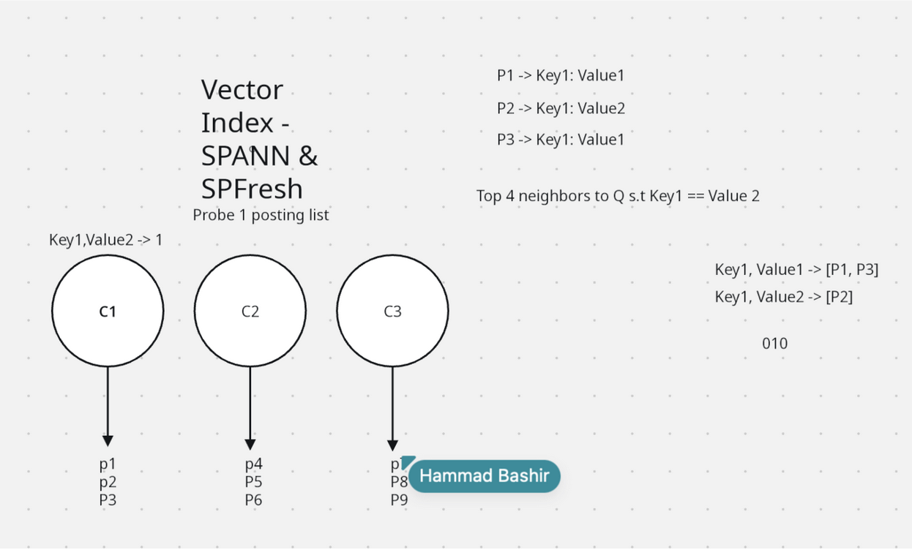

Chroma vector search metadata indexing project exploration
Vector Search with Inverted Indices (call with Hammad, CTO at ChromaDB)

    Chroma uses inverted index approach for vector search (K-nearest neighbors)
        Cluster vectors using K-means or similar
        Assign remaining points to closest centroids as posting lists
        At search time: select closest centroids, brute force candidates in those lists
        Prunes search space by partitioning upfront
    Based on Microsoft research algorithms: SPANN and SPFresh
        Both are inverted indexing algorithms with same end data structure
        Research papers available and relatively easy to understand
        Requires basic math and trigonometry concepts

Filtering Problem & Proposed Solution

    Current filtering approach degrades accuracy
        Separate metadata inverted index built alongside vector index
        Query plan: create bitmask from metadata filter, apply during vector search
        Problem: may filter out all candidates in selected centroids while missing relevant points in other clusters
    Proposed metadata statistics solution:
        Keep statistics for every metadata value in every centroid/posting list
        Enable intelligent query planning decisions about which clusters to search
        Example: if searching for “author=Zach” and centroid has no Zach entries, skip it
        Store min/max bounds for high-cardinality keys (like timestamps)
    Implementation approach:
        Modify existing SPANN index (200 lines of code)
        Add metadata tracking as data comes in
        Start with isolated experiment, then production-grade implementation
        Expected outcome: improved recall on filtered search

---

Adaptive Query Planning for Filtered Search in Chroma
Kartik Pingle: kpingle
Zach Marinov: zmarinov
Evan Kim: evan_kim
Abstract: Vector databases like Chroma need to support filtered queries, where a similarity search is constrained by metadata conditions. The order in which filtering and searching happen matters a lot for performance, but most systems use a fixed strategy regardless of the query. This project builds an adaptive query planner for Chroma that picks the best execution strategy based on filter characteristics and index statistics. We evaluate on synthetic and real workloads, measuring latency, recall, and planning overhead against Chroma's current approach.
Intro: Filtered vector search is one of the most common query patterns in embedding databases. A user asks something like: "find the 10 most similar documents to this query, but only among docs tagged 'biology' from the last 30 days." The database has to combine a metadata filter with an approximate nearest-neighbor (ANN) search, and the order it does this in has major performance implications.
There are two basic approaches. Pre-filtering removes non-matching items first, then searches the reduced set. Post-filtering searches the full index first, then discards results that don't match the filter. Both have failure modes. If almost everything passes the filter, pre-filtering adds overhead for no gain. If almost nothing passes, post-filtering wastes compute searching through vectors it will throw away.
This project matters because filtered queries are the default in real applications. RAG pipelines almost always scope searches by metadata. As databases scale to millions of vectors, picking the wrong strategy can mean the difference between sub-100ms responses and multi-second timeouts. An adaptive planner that picks the right strategy per query is essential for Chroma to handle production workloads at scale.
Methodology: We plan three phases. First, we profile Chroma's existing filtered query execution to build baselines and understand where time is being spent. Second, we build a cost model that estimates performance of pre-filter, post-filter, and hybrid approaches for a given query. The cost model uses filter selectivity (what fraction of data passes the filter), cluster-level summaries, and index parameters. We will explore both rule-based heuristics and a lightweight learned model trained on profiling data. Third, we integrate the planner into Chroma's query path so it selects a strategy before execution, keeping the planning step fast enough that it doesn't become a bottleneck itself.
Evaluation: We evaluate on three axes: query latency (end-to-end and broken down by phase), recall (making sure result quality isn't sacrificed for speed), and planning overhead. We compare against Chroma's default strategy and an oracle baseline that exhaustively tries all strategies. We sweep across filter selectivities (0.01% to 99%), dataset sizes (10K to 10M vectors), and embedding dimensions (128 to 1536).
Data: We use synthetic datasets with controllable metadata selectivity alongside real embedding datasets like MS MARCO passages with synthetic metadata. If the Chroma team can share anonymized query logs, we will also validate against real usage patterns.
Task List:
Instrument Chroma's filtered query path and collect profiling data.
Implement selectivity estimation using lightweight statistics.
Design a cost model mapping query characteristics to strategy selection.
Build the adaptive planner module.
Implement a hybrid execution path (partial pre-filter + expanded search + post-filter).
Evaluate on synthetic benchmarks.
Evaluate on real-world datasets.
Explore a learned cost model variant.
Write up results and prepare a PR for Chroma.
Timeline: Mid-Term Report: Codebase instrumentation, baseline profiling, selectivity estimation, and initial cost model design (tasks 1-3). Project Presentation: Adaptive planner and hybrid execution path implemented, evaluated on synthetic benchmarks (tasks 4-6). Final Hand-in: Real-world evaluation, learned cost model exploration, writeup, and PR to Chroma (tasks 7-9).
Deliverables:
A working adaptive query planner integrated into Chroma, submitted as a pull request.
A reusable benchmark suite for filtered vector search.
A report documenting the cost model, evaluation, and analysis of when each strategy wins.
(Stretch) A learned cost model that improves on the heuristic approach.

---

# Meeting with our Professor Tianyu

### Filtered Vector Search — Approaches

- Two main filtering strategies under consideration:
  - Pre-filtering: evaluate filter conditions on full dataset first, then search the smaller candidate set (or skip vector search entirely if set is small enough)
  - Post-filtering: run vector search first, then apply filter — risks not having enough results left to satisfy the query
- Both approaches have inverted failure modes: one fails at high selectivity, the other at low
- Goal isn’t a better algorithm — it’s knowing when to use which approach
- Hybrid approach also floated: filter and search simultaneously, updating search based on filter results

### Scoping & Strategy

- Project is currently too broad — needs to be scoped down given the timeline (weeks, not a year)
- Two viable paths:
  1. Define pre- and post-filtering as the two options, then focus on optimally choosing between them
  2. Pick one algorithm (Chrome appears to use pre-filtering) and fix a specific failure case
- Core goal from the advisor: demonstrate improved recall — how that’s achieved is flexible

### Parallel Workstreams

- Team of three should work on different ideas in parallel rather than the same codebase simultaneously
  - Maximizes chance of finding a strategy that actually improves recall
  - Avoids stepping on each other’s toes
- Treat this as a research problem: run many experiments, see what works

### Next Steps

- Find a sufficiently general benchmark dataset (large public corpora recommended) to run experiments against
- Submit midterm report (due Tuesday) with a range of results from things tried so far — no need for a cohesive story yet
- A few weeks before the final report, identify the most effective strategy and build a narrative around it: problem → importance → solution → experimental justification
- Keep the team updated on progress
