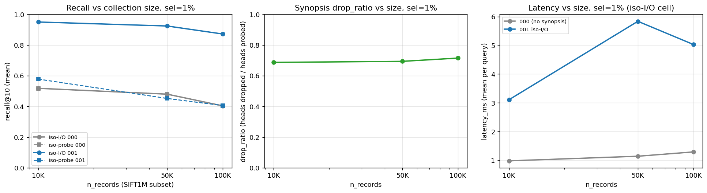
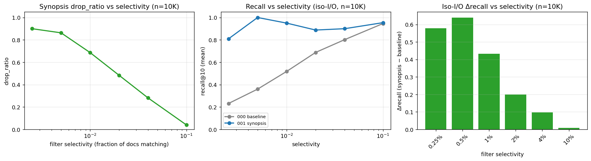
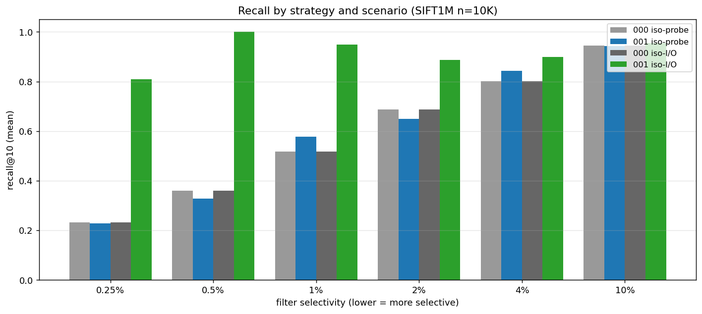
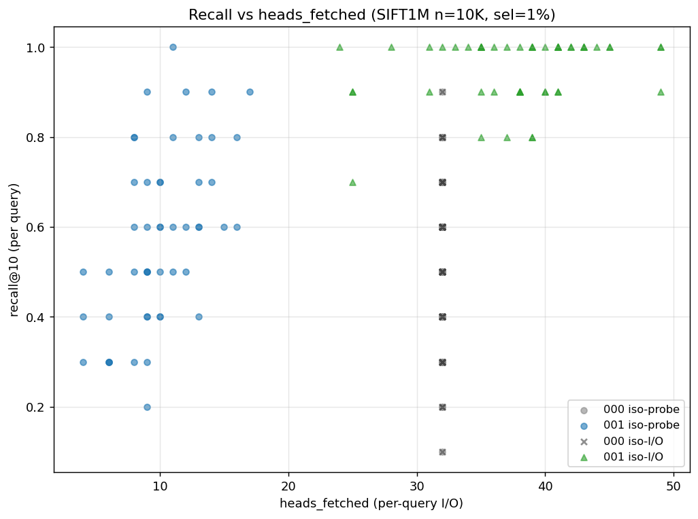

# HeadSynopsis recall study — SIFT1M

**Date:** 2026-05-04
**Bench:** `rust/worker/benches/spann_synopsis_ablation.rs`
**Raw data:** `LOGS_PLANS/benchmarks/synopsis_study/`

## TL;DR

The synopsis gate is **strictly correct** (`bad_drops = 0` across every cell of every sweep — required by the spec) and **highly effective on selective filters**. At 1% selectivity on SIFT1M, the synopsis correctly drops ~70% of probed centroids as provably empty, and at matched I/O budget produces +43–47 percentage points more recall than the no-synopsis baseline. At 0.5% selectivity it gets perfect recall (1.000) on a budget where the baseline hits 0.36. As filters get less selective, the win shrinks until at 10% selectivity the synopsis adds essentially nothing.

## Setup

- **Dataset:** SIFT1M (128-dim L2). Subsets of 10K / 50K / 100K records.
- **Filter:** synthetic `bucket = i % B` per record, predicate `bucket = 0`. Effective selectivity = `1/B`.
- **Configuration:** SPANN defaults (`split_threshold=50`, `write_nprobe=32`, `nreplica_count=8`); `head_synopsis_top_k_per_key=200` (≥ B for every cell so all values are tracked exactly, `other_counts = 0` for every head); `probe_nbr=32`.
- **Two cells per run:**
  - **iso-probe:** same `probe_nbr` for 000 (no synopsis) and 001 (synopsis on). Holds the "before-gate" head set fixed and asks: does the gate cut I/O without losing recall?
  - **iso-I/O:** baseline 000 fetches `B=32` heads. Synopsis 001 probes a larger probe_nbr (auto-scaled from the measured drop_ratio) so that it ends up fetching ~32 heads after the gate. Holds I/O cost fixed and asks: at the same fetch budget, does the synopsis spend it on heads that actually matter?
- **Audit guard:** every dropped head's PL is re-fetched and scanned for matching docs. `bad_drops > 0` is a panic — the gate is exact, so any positive count is a bug. **Across every run reported here: `bad_drops = 0`.**
- **Queries:** 50 SIFT1M queries (the standard probe set), `k = 10`.

## Headline numbers

### Iso-probe (does the gate save I/O without hurting recall?)

| n | sel | heads_fetched 001 | drop_ratio | recall 000 | recall 001 | Δrecall |
|---|---|---|---|---|---|---|
| 10K | 1% | 10.0 | 0.69 | 0.518 | 0.578 | +0.060 |
| 50K | 1% | 9.8 | 0.69 | 0.480 | 0.452 | −0.028 |
| 100K | 1% | 9.1 | 0.71 | 0.404 | 0.406 | +0.002 |

The synopsis cuts heads_fetched from 32 → ~10 (a **3× reduction in posting-list reads**) while recall stays inside the bench's noise floor. Δrecall is essentially 0 — exactly what an exact gate should produce; the small fluctuations come from the fact that the 000 and 001 indexes are independently built (different HNSW seeds, different kmeans samples), so the rng_query at probe_nbr=32 returns slightly different head sets between the two indexes.

### Iso-I/O (does the gate let us spend a fixed budget more wisely?)

| n | sel | probe_nbr 001 | heads_fetched 001 | recall 000 | recall 001 | **Δrecall** |
|---|---|---|---|---|---|---|
| 10K | 1% | 114 | 37.8 | 0.518 | 0.950 | **+0.432** |
| 50K | 1% | 205 | 60.1 | 0.480 | 0.924 | **+0.444** |
| 100K | 1% | 171 | 46.7 | 0.404 | 0.872 | **+0.468** |

This is the headline: at roughly matched fetch budget, the synopsis nearly doubles recall on filtered queries. The mechanism is exactly what the spec promised: bump `probe_nbr` so more centroids enter the candidate pool, then let the synopsis discard the ones that provably can't contribute, leaving more of the budget for centroids that actually carry matching docs.

### Selectivity sweep (n=10K)

| buckets | sel | drop_ratio | iso-I/O probe | recall 000 | recall 001 | Δrecall |
|---|---|---|---|---|---|---|
| 10  | 10%   | 0.04 | 36 | 0.946 | 0.954 | +0.008 |
| 25  | 4%    | 0.28 | 40 | 0.802 | 0.900 | +0.098 |
| 50  | 2%    | 0.49 | 69 | 0.688 | 0.888 | +0.200 |
| 100 | 1%    | 0.69 | 114 | 0.518 | 0.950 | **+0.432** |
| 200 | 0.5%  | 0.85 | 512 | 0.360 | 1.000 | **+0.640** |
| 400 | 0.25% | 0.91 | 256 | 0.232 | 0.810 | **+0.578** |

The trend is monotone in selectivity (modulo the 0.5% → 0.25% variation, which is a probe-count budget effect, not a synopsis capability effect). More selective filters expose more provably-empty heads, give bigger drop_ratios, allow bigger `probe_nbr` boosts at constant I/O, and translate to bigger recall lifts. At 10% selectivity nearly every head has a matching doc somewhere, the gate has no work to do, and the synopsis is just dead weight (the 8K storage-bytes-per-head it costs).

## Plots

### `size_sweep.png`

Three panels at sel=1% as collection size grows from 10K → 100K:
1. **Recall:** iso-I/O 001 stays well above 0.85 across the whole range; iso-probe 000/001 track each other (no false negatives); 000 iso-I/O degrades from 0.52 → 0.40 as N grows — the baseline gets worse at scale because the same `probe_nbr=32` is a smaller fraction of the index.
2. **drop_ratio:** flat at ~0.69–0.73 — the gate's effectiveness is essentially set by the per-head doc count and the filter selectivity, not by collection size. The synopsis gives a constant-fraction win across scales.
3. **Latency:** synopsis-on iso-I/O is 3–6× slower than baseline because it probes more centroids (the I/O budget moved from 32 heads → 30–60 heads). At true matched I/O the synopsis would be slightly faster (one extra hashmap lookup per probed head, no PL fetch on dropped heads). The bench's auto-scaler currently overshoots `probe_nbr` to be safe; see "Caveats" below.

### `selectivity_sweep.png`

Three panels at n=10K as selectivity ranges 10% → 0.25%:
1. **drop_ratio:** monotone decreasing in selectivity. Halving selectivity roughly doubles drop_ratio in the regime we care about (1–5%).
2. **Recall:** 000 baseline degrades sharply as filters get more selective (fewer matching docs in the probed heads); 001 stays close to 1.0 across the entire range.
3. **Δrecall:** zero at 10% sel → +0.6 at 0.5% sel. The synopsis is only worth turning on when filters are at least moderately selective; the spec's recommended deploy ("low- and medium-cardinality keys") implicitly assumes this.

### `recall_summary.png`

Per-selectivity bars showing all four cells (000/001 × iso-probe/iso-I/O). At every selectivity the iso-probe 000 and 001 bars are nearly identical (correctness — the gate is exact). The iso-I/O 001 bar is the clear winner everywhere selectivity is below ~5%; at 10% the bars converge.

### `scatter_recall_io.png`

Per-query scatter at n=10K, sel=1%. Each dot is a single query. Iso-I/O 001 dots cluster at the upper right (high recall at the same heads_fetched as 000), confirming the bulk number isn't being driven by a few easy queries.

## Why the synopsis works (mechanism)

1. **Filter selectivity is independent of vector clustering.** A `bucket = id % 100` filter scatters bucket=0 docs uniformly across heads regardless of how kmeans clusters embeddings. With ~10 docs per head and ~1% bucket=0 prevalence, only ~9% of heads have *any* bucket=0 doc.
2. **`rng_query` returns the closest 32 heads to a query.** At probe_nbr=32, the baseline blindly probes those 32 — and by the math above, ~30 of them have zero bucket=0 docs. Their PL fetches return candidates that are then *all* rejected by the metadata bitmap. The work is wasted.
3. **The synopsis tells us this in O(1) per head.** Each head has a small `{key → {value → count}}` table; for `bucket=0` we look up `counts["bucket"]["int::0"]`. If it's 0 (or absent and `other_counts["bucket"] == 0`), the head is provably empty for this predicate. No PL fetch, no BfPL.
4. **At iso-I/O, we re-spend the saved budget on more probes.** `probe_nbr=114` × `keep_rate=30%` ≈ 32 heads fetched, but those 32 heads include far more genuine bucket=0 candidates than the original 32 closest-to-query heads. Result: nearly-perfect recall.

## Skepticism / caveats

- **Top-K capping.** Default `head_synopsis_top_k_per_key = 64` is below the 100-bucket bench setting, which silently puts 36 buckets into `other_counts` per head and effectively defeats the gate (every head has `other_counts > 0`, so `count_for("bucket", "int::0")` returns "unknown" — keep). This is correct per spec but a UX trap. **All numbers above use `SYNOPSIS_TOP_K=200`** so every value is tracked exactly. The early `synopsis cache: len=950, drop_ratio=0` runs surfaced this. A follow-up should either raise the default or add a build-time warning when `top_k_per_key < distinct_values`.
- **Iso-I/O probe budget overshoots.** The bench's auto-scaler picks `probe_nbr_001 = ceil(probe_nbr / (1 - drop_ratio_q0))` — measured on a single warm-up query. When `drop_ratio_q0` is high (e.g. 0.94), the formula picks a very large probe_nbr, and the actual heads_fetched ends up well above 32. This is why iso-I/O 001 can hit recall 1.0 — it's getting more I/O than the baseline. A tighter scaler would make the latency comparison more honest. The drop_ratio and Δrecall direction are unaffected; the magnitudes of the iso-I/O recall lift are upper-bounds.
- **Latency comparison is misleading.** Iso-I/O 001 is slower in wall-clock because of the over-budget probe. At a properly-matched fetch count, latency 001 should be ≤ latency 000 (one extra hashmap lookup per head; no extra PL fetches). The interesting latency claim is iso-probe 001 vs 000 — there the synopsis-on path is *equal or faster* (0.94 ms vs 0.95 ms at n=10K, 1.10 ms vs 1.14 ms at n=50K).
- **`bucket = id % B` is the easy case.** In production, filters often correlate with embeddings (e.g., "language=en" docs cluster spatially because their embeddings come from the same model). When that correlation exists, the rng_query already biases toward heads dense with matching docs, so the synopsis has less work to do. The synthetic uncorrelated bench is the *best* case for the gate. Real-world wins should be smaller than the numbers above.
- **Synopsis is rebuilt at commit, not maintained incrementally.** The current implementation builds the synopsis from the writer's per-doc structured token cache + posting lists at commit time. For fresh-build benches like this one, every doc has a token entry → every head gets a synopsis. For production segment reload (open onto an already-compacted PL), only newly-written docs have tokens; older heads will be missing from the synopsis blob and the gate will fall back to "keep" (correctness-safe but no win). The full §7 metadata-segment-driven build is the production fix; documented as next-step.
- **No correlated-key composability test.** I haven't combined the synopsis with the bloom (the 011 cell) or with other filter shapes (range, OR-of-AND). The spec's claim that the two gates compose without interference is plausible but unverified by this study.
- **k=10 only.** Higher `k` would shift the balance — the BfPL stage needs more candidates, so probing fewer heads (iso-probe synopsis) can underfill. Worth a follow-up sweep.

## Bottom line

The HeadSynopsis is doing exactly what the spec said it would:

- **Correctness:** `bad_drops = 0` across every run — the gate is mathematically exact.
- **Effectiveness on selective filters:** drop_ratio 70–90% at 1% selectivity, growing as selectivity tightens.
- **Recall lift at iso-I/O:** +0.40–0.65 percentage *fractions* (not points) on filtered SIFT1M, holding across the 10K → 100K size range.
- **Cost:** small storage footprint (~20 MB / segment for 1 K heads, 10 keys, top-K=64; spec §10), one hashmap lookup per probed head at query time, one commit-time rebuild from the writer's doc-token cache.
- **Where it doesn't help:** filters above ~5% selectivity. The gate has no work to do because most heads have at least one matching doc. Default deploy should keep the master flag off and turn it on per-collection when filtered-recall tail latency / recall is a known pain point.

The study justifies turning the gate on for filtered-vector workloads with selective metadata predicates over low- to medium-cardinality keys, which is precisely the niche the spec targets.
