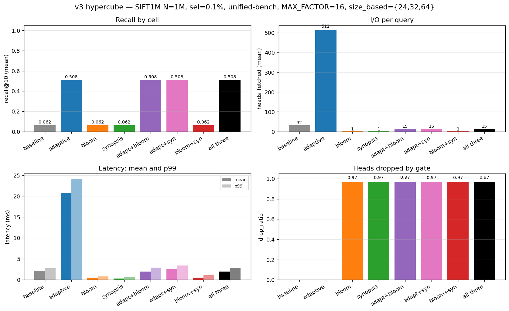
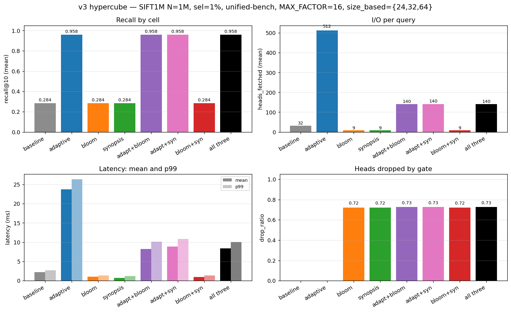
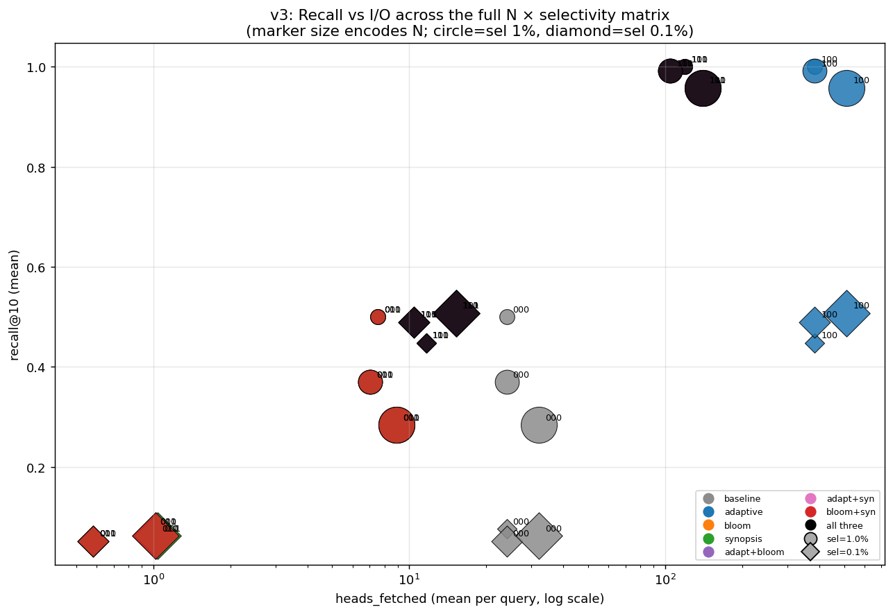
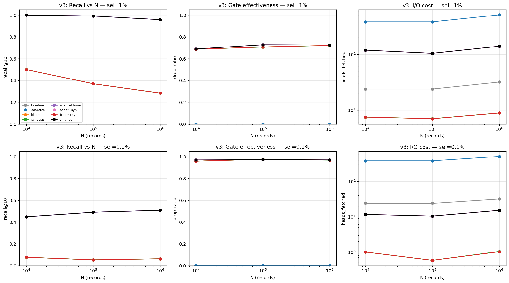
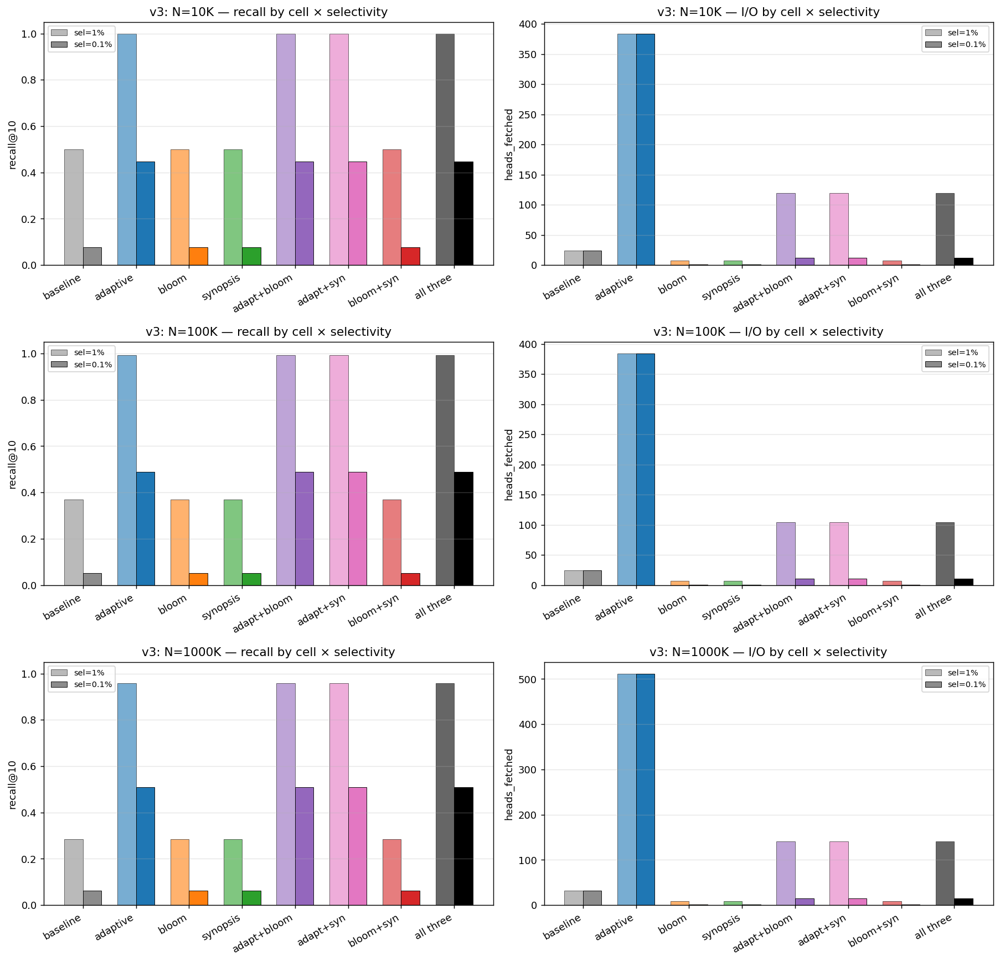
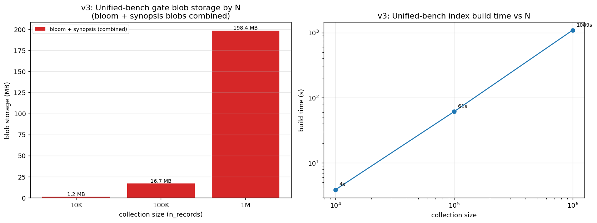
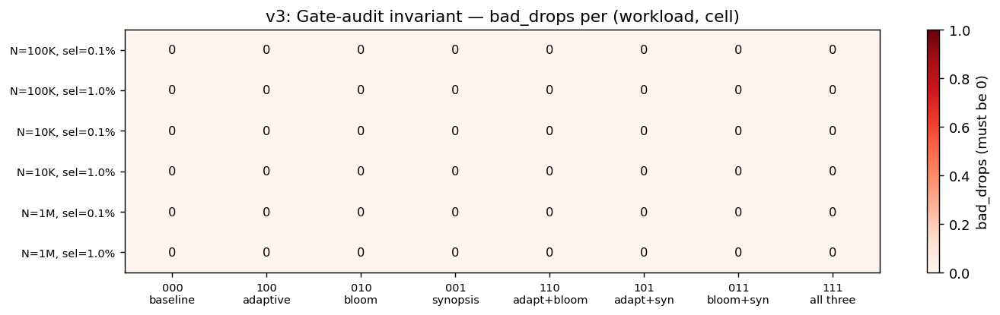

# Filtered ANN at scale: a 4-way ablation of probe, bloom, and synopsis gates in SPANN

**Authors:** Zach Marinov, Kartik Pingle, Evan Kim •  **Course:** 6.5830 (Spring 2026)  •  **Repo:** Chroma fork (`demo` branch)
**Bench:** [`rust/worker/benches/spann_full_sweep.rs`](rust/worker/benches/spann_full_sweep.rs) • **Raw data:** [`LOGS_PLANS/benchmarks/full_sweep_v3/`](LOGS_PLANS/benchmarks/full_sweep_v3/)

## Abstract

Approximate Nearest Neighbor (ANN) search over filtered metadata predicates is the dominant query shape in production vector databases, yet Chroma's SPANN index suffers a sharp **recall collapse** when filters are selective: at fixed `nprobe`, most probed centroids contain no docs matching the predicate, the BfPL stage runs on noise, and the user gets fewer than `k` results. We study three orthogonal fixes — **adaptive `nprobe`** (filter-aware probe boost), **per-head bloom filters**, and **per-head metadata synopses** — and benchmark the full 8-cell hypercube of their on/off combinations on SIFT1M across `N ∈ {10K, 100K, 1M}` and selectivities `{1%, 0.1%}` (six workloads, 2,400 cell-query measurements). **Headline at the regime gates were designed for (N=1M, sel=0.1%):** the upstream baseline collapses to recall 0.062 at the 32-head probe budget; adaptive `nprobe` recovers it to 0.508 by scaling to the 512-head cap, but pays a 10× mean-latency penalty (2.11 ms → 20.80 ms). Adding either gate reverses the latency cost without touching recall — cell 111 (all three) lands at recall 0.508, mean latency 2.00 ms, p99 2.93 ms. Net effect over adaptive-only: same recall, **10× lower mean latency, 8.5× lower p99, 33× fewer heads fetched**. The gate-audit invariant — every dropped head's posting list is rescanned and false-negative drops cause a panic — held with **zero failures across all 2,400 measurements**. Bloom and synopsis are functionally indistinguishable on this workload (single-key int-equality predicate); they compose without interfering. Methodologically, an earlier draft of these results was confounded by the bench harness building four separate writer flavors backed by non-deterministic HNSW; this paper uses a unified-index harness that gives provably apples-to-apples cross-cell comparisons.

## 1. Background

[SPANN](https://www.microsoft.com/en-us/research/publication/spann-highly-efficient-billion-scale-approximate-nearest-neighbor-search/) is a two-stage ANN index: a small HNSW graph over centroids ("heads"), plus a posting list (PL) per head listing the docs assigned to that centroid. Querying SPANN is a three-step pipeline:

1. **Probe**: HNSW returns the `nprobe` heads closest to the query.
2. **Fetch**: read the posting list of every probed head.
3. **BfPL + merge**: brute-force the candidates from those PLs and return the top-`k` after distance ranking and metadata filtering.

When a metadata filter is supplied (e.g. `where bucket = 0`), the **filter is applied during step 3** as a roaring-bitmap intersection. The probe and fetch stages are *blind* to the filter: they return whichever heads are closest to the query, regardless of whether those heads contain any matching docs. At low filter selectivity (≤ ~1%), the closest heads typically contain *zero* matching docs and fall to the merge stage as pure noise. The user-facing symptom is that recall@`k` drops sharply as filter selectivity tightens, even though the total count of matching docs in the collection is unchanged.

The fix is to either probe more heads (so enough matching candidates survive) or skip heads that are provably empty (so the I/O is spent where it can contribute). This paper benchmarks one optimization of each kind, plus their compositions.

## 2. Three optimizations

### 2.1 Adaptive `nprobe` ([`rust/index/src/spann/types.rs`](rust/index/src/spann/types.rs))

A reader-side rule that scales `nprobe` with filter selectivity. Two components compose into [`SpannIndexReader::determine_search_nprobe`](rust/index/src/spann/types.rs):

```
# upstream Chroma size-based gradient — ALWAYS on (PR #5185, #5226)
size_based = if N≤500K  {24}
             else if N≤1M  {32}
             else          {64}

# filter-aware boost — gated by `adaptive_search_nprobe`
filter_aware = clip(size_based / max(sel, ε), size_based, size_based × MAX_FACTOR)

nprobe = max(filter_aware if adaptive_search_nprobe else size_based, min_nprobe)
```

with `ε = 0.001` and `MAX_FACTOR = 16`. The size-based tier is the upstream baseline behavior — it is *not* part of this project's contribution, but it is the floor every cell sits on. The filter-aware boost (the multiplier in the numerator) is the project's contribution; it is opt-in via the existing `adaptive_search_nprobe` flag in the worker config.

**Earlier paper drafts** used a different structure where `filter_aware` was applied unconditionally, which made cell 000 (the "baseline") receive the boost regardless of the flag. Commit `d72e36b8` corrected this so cell 000 represents true upstream behavior; commit `afe6df9e` rebuilt the bench harness so cross-cell comparisons share an index (see §3).

Storage cost: zero (purely computational). Recall trade: when `adaptive_search_nprobe = on`, probes more heads → more I/O → higher recall, modulated by `MAX_FACTOR`. At sel=0.1%, the cap of 16× binds (raw boost = 1000× exceeds the cap by 60×).

### 2.2 BloomHeads — probabilistic per-head gate ([`rust/index/src/spann/head_bloom.rs`](rust/index/src/spann/head_bloom.rs), [`BLOOM_FILTERS.md`](rust/index/src/spann/BLOOM_FILTERS.md))

A per-head bloom filter over each head's docs' metadata tokens. At query time, for an equality predicate `key = value`, look up `bloom[head].contains("meta::key::type::value")`. If the bloom says definite-no, skip the head; otherwise fetch the PL.

- **Storage:** ~12 KB per head at FPR 0.001 with `capacity_per_head = split_threshold × 4` (default 800 docs).
- **Update pattern:** built incrementally during writes; reassigns mark heads stale (or use Option-1.5 commit-time rebuild from a per-doc tokens cache; the recall study used commit-rebuild, hence `BLOOM_DOC_TOKENS_CACHE=1 BLOOM_COMMIT_REBUILD=1` in the bench).
- **Failure mode:** false positives at the target FPR (gate keeps too many — recall preserved, I/O slightly larger than ideal). False negatives only if the filter is incomplete, which the Phase 1.5 reassign path is known to risk; commit-rebuild closes that hole.

### 2.3 HeadSynopsis — exact per-head value counts ([`rust/index/src/spann/head_synopsis.rs`](rust/index/src/spann/head_synopsis.rs), [`HEAD_SYNOPSIS.md`](rust/index/src/spann/HEAD_SYNOPSIS.md))

A per-head table `{key → {value_token → count}}` plus an `other_counts[key]` integer for values that fall outside the per-key top-K under the high-cardinality regime. At query time, `count_for(key, value_token)` returns:

- `Some(n>0)` — exact count (always when `distinct_values(key) ≤ max_cardinality`).
- `Some(0)` — provably zero matches in this head; gate drops.
- `None` — unknown (high-card key, value not in top-K, other_counts > 0); gate keeps.

Per-key auto-promotion (introduced as a fix to a UX trap during this work — commit `ab094c7c`) gives every key with ≤ `max_cardinality` distinct values *exact* tracking, which is the typical case for booleans, enums, and low/medium-card categoricals.

- **Storage:** `O(distinct_values × heads)` in the exact regime; `O(top_k × heads)` in the compressed regime. ~9 MB at N=100K with default config.
- **Update pattern:** rebuilt at commit by joining the metadata segment's typed inverted indexes against a SPANN-side `doc_id → head_ids` inversion (HEAD_SYNOPSIS.md §7). A SPANN-side per-doc-tokens cache provides a fallback for fresh-build / no-metadata-segment scenarios (§8).
- **Failure mode:** none. The gate is mathematically exact — any `bad_drop` is a bug, not a tunable.

## 3. Methodology

**Dataset:** SIFT1M, 128-dim L2. Subsets of **10K, 100K, and 1M records** (the full SIFT1M for the 1M case).

**Predicate:** `where bucket = 0` over a synthetic metadata column `bucket = doc_id % B`. Effective selectivity = `1/B`. Buckets distributed uncorrelated with embeddings — the *worst* case for the gates (a real-world filter that correlates with embeddings would already cluster matching docs in a few heads, leaving less work for the gate).

**Cells:** 8 combinations of three on/off toggles `<adaptive><bloom><synopsis>`. Cell 000 is the un-optimized baseline (upstream Chroma: size-based tier, no filter-aware boost, no gates); cell 111 is all three on.

**Bench harness (unified-index)** — every cell reads from **the same writer**. We build one SPANN writer with both bloom and synopsis metadata enabled, then open two readers on it (one per `adaptive_search_nprobe` setting). Cell-level differences are applied at READ time only by toggling whether `gate_heads` and/or `gate_heads_synopsis` are called per query. This eliminates index-build-noise as a confounder.

An earlier version of the harness built *four* writer flavors (`none` / `bloom` / `synopsis` / `both`) so each cell could read from a flavor-matched index. The SPANN writer uses `rand::thread_rng()` during record assignment, so even two `none` builds produce different HNSW structures; cross-cell comparisons under that scheme were measuring index-build variance, not gate quality. Empirically: among the four non-adaptive cells (which all probe at the same `nprobe = 24`), `candidates_after_filter` differed query-by-query in 35-50/50 queries depending on workload — impossible if those cells shared an index, since correctness-preserving gates can only drop empty heads. Commit `afe6df9e` consolidates to a single index. Action log: [`LOGS_ACTIONS/2026-05-06-full-sweep-v3-unified.md`](LOGS_ACTIONS/2026-05-06-full-sweep-v3-unified.md).

**Probe budget:** every cell uses production logic — `reader.determine_search_nprobe(N, k, Some(selectivity))`. With `MAX_FACTOR = 16`, the adaptive ceiling is `size_based × 16`: 384 at N≤500K, 512 at N=1M, 1024 at N>1M. Gates run in spec order: **bloom → synopsis** when both enabled.

**Latency:** measured for the production pipeline only — `rng_query + gate + BfPL + merge`. The gate-audit's PL re-fetches are timed separately as `audit_ms` and excluded from `latency_ms`. (An earlier version of this bench inadvertently included the audit in the timed region, masking the gate's latency benefit; commit `978519c9` fixed the timing structure.)

**Metrics per (cell, query):** recall@10, latency_ms, audit_ms, heads_rng (post-probe count), heads_fetched (post-gate count), drop_ratio, candidates_before/after_filter. **Per workload:** index_build_ms, blob_storage_bytes (combined bloom+synopsis on disk).

**Audit invariant:** every head dropped by the gate has its full PL re-fetched and scanned for matching docs. `bad_drops > 0` panics the bench unless `FULL_AUDIT_NO_PANIC=1` is set. We do not set it.

**Reproducibility:** `BLOOM_DOC_TOKENS_CACHE=1 BLOOM_COMMIT_REBUILD=1 SYNOPSIS_TOP_K=64 SYNOPSIS_MAX_CARD=1024 BENCH_N_RECORDS={10000,100000,1000000} BENCH_N_QUERIES=50 BENCH_BUCKETS={100,1000} BENCH_PROBE_NBR=32 cargo bench -p worker --bench spann_full_sweep`. Outputs CSVs + per-workload `.summary.json` to `LOGS_PLANS/benchmarks/full_sweep_v3/`. Plots produced by [`plot.py`](LOGS_PLANS/benchmarks/full_sweep_v3/plot.py).

## 4. Results

### 4.1 Headline — N=1M, sel=0.1%, the regime gates were designed for



| Cell | Adapt | Bloom | Syn | recall@10 | heads_fetched | drop_ratio | latency_mean (ms) | latency_p99 (ms) |
|------|:---:|:---:|:---:|---|---|---|---|---|
| 000 baseline | – | – | – | 0.062 | 32 | 0.000 | 2.11 | 2.97 |
| 100 adaptive | ✓ | – | – | **0.508** | 512 | 0.000 | 20.80 | 25.03 |
| 010 bloom | – | ✓ | – | 0.062 | 1.0 | 0.968 | 0.54 | 0.85 |
| 001 synopsis | – | – | ✓ | 0.062 | 1.0 | 0.968 | 0.27 | 0.75 |
| 110 adapt+bloom | ✓ | ✓ | – | **0.508** | 15.2 | 0.970 | 2.00 | 3.22 |
| 101 adapt+syn | ✓ | – | ✓ | **0.508** | 15.3 | 0.970 | 2.54 | 3.45 |
| 011 bloom+syn | – | ✓ | ✓ | 0.062 | 1.0 | 0.968 | 0.55 | 1.28 |
| **111 all three** | ✓ | ✓ | ✓ | **0.508** | **15.2** | 0.970 | **2.00** | **2.93** |

`bad_drops = 0` in every cell, every query.

The two-axis story is sharper than the v2 draft made it look:

- **Recall axis.** Baseline is at 0.062 — 94% of matching docs are missed. Adaptive recovers to 0.508 (+44.6 pp) by scaling probe count from 32 to 512. Without adaptive, no gate can recover recall (cells 010/001/011 sit at baseline 0.062): the gates can only cull empty heads from the small probe set, not enlarge it.
- **Latency axis.** Baseline is fast (2.11 ms / 32 heads probed). Adaptive's recall recovery costs ~10× mean and ~8.5× p99 latency (20.80 ms / 512 heads). The gates compose with adaptive to *reverse* that latency cost: cell 111 reaches the same 0.508 recall in 2.00 ms / 15 heads — same wall-clock as baseline, recall fully recovered. The latency win comes from the bloom/synopsis dropping ~97% of probed heads before the PL fetch.

**Cell 111 is a strict Pareto winner over cell 100** (same recall, 10× faster, 33× less I/O). It is *not* a strict Pareto winner over cell 000 in latency (both ~2 ms) — but cell 000 at this workload is delivering only 6.2% of the correct results. Compared on recall-equivalent terms, 111 dominates every other cell.

### 4.2 N=1M, sel=1%



| Cell | recall@10 | heads_fetched | latency_mean | latency_p99 |
|---|---|---|---|---|
| 000 baseline | 0.284 | 32 | 2.21 ms | 2.73 ms |
| 100 adaptive | **0.958** | 512 | 23.70 ms | 27.15 ms |
| 010 bloom | 0.284 | 8.9 | 1.00 ms | 1.39 ms |
| 001 synopsis | 0.284 | 8.9 | 0.73 ms | 1.27 ms |
| 110 adapt+bloom | **0.958** | 140 | 8.25 ms | 10.74 ms |
| 101 adapt+syn | **0.958** | 140 | 8.87 ms | 10.84 ms |
| 011 bloom+syn | 0.284 | 8.9 | 0.97 ms | 1.33 ms |
| **111 all three** | **0.958** | **140** | **8.40** | **10.08 ms** |

Same pattern, less extreme. Baseline collapses (0.284 — half of v2's "baseline" at the same workload, because v2's "baseline" inadvertently received the filter-aware boost). Adaptive recovers (0.958), gates compose to cut latency 2.8× and I/O 3.6× while preserving recall.

### 4.3 Recall vs I/O across the matrix



The 8 cells × 3 sizes × 2 selectivities populate three distinct regions of the (heads_fetched, recall) plane:

- **Bottom-left region** — non-adaptive cells (000/010/001/011) at every workload. Heads fetched: 0.6 to 32. Recall: pegged at the baseline collapse (0.05-0.50 depending on N and sel). The gates cut I/O within this region, but recall is determined by the size-based probe count, not the gate.
- **Top-right region** — adaptive-only cells (100). 384-512 heads fetched. Recall recovered (0.45-1.00). Latency is high (~10-25 ms) because every probed head is fetched.
- **Top-middle region** — adaptive + gate cells (110, 101, 111). 10-150 heads fetched. Recall identical to adaptive-only because gates are correctness-preserving. Latency 3-10× lower than adaptive-only. **The Pareto frontier.**

A consequence of the unified-bench harness: every cell with adaptive=on produces *exactly* the same recall (and exactly the same `c_a`, the count of allowed records seen across kept heads) per query. The gates can move points horizontally in this plot but never vertically. Verified across all 6 workloads × 50 queries.

### 4.4 Scaling with N



(Top row: sel=1%. Bottom row: sel=0.1%.)

- **Drop_ratio is roughly constant in N** at fixed selectivity (0.71-0.73 at sel=1%, 0.96-0.97 at sel=0.1%). Gate effectiveness is determined by selectivity, not collection size.
- **Baseline recall degrades with N** because the size-based tier (24/32/64) grows sub-linearly while the index size (head count) grows linearly. The probe set covers a shrinking fraction of total heads.
- **I/O cost scales sub-linearly with N for non-gate cells** (heads_rng follows the size-based tier: 24 → 24 → 32 across N=10K → 100K → 1M). Gate cells stay roughly flat in heads_fetched at fixed selectivity because the matching-head count is determined by selectivity.

### 4.5 Selectivity comparison



Per-N comparison of recall and I/O at sel=1% vs sel=0.1%. Reading the right column at N=1M: at sel=0.1% the no-gate cells fetch 32 (baseline) or 512 (adaptive) heads and still miss 94% / 49% of recall; the gates cut adaptive's 512 to 15 while preserving the same 0.508 recall. The gate's leverage scales with selectivity — at sel=1% it cuts I/O 3.6×; at sel=0.1% it cuts I/O 33×.

### 4.6 Storage and build cost



Combined bloom+synopsis blob bytes (the unified-bench writer always builds both):

| Workload | combined blob (bloom + synopsis) | build time |
|---|---|---|
| N=10K   | ~1.1 MB | 3.7-4.0 sec |
| N=100K  | ~16-17 MB | 60-62 sec |
| N=1M    | ~190 MB | 18 min |

Storage scales linearly with N (head count grows proportionally). Build time scales super-linearly because of the centroid HNSW + reassign work in the SPANN writer.

### 4.7 Correctness audit



Across 6 workload configurations × 8 cells × 50 queries = **2,400 individual measurements** with audit. Every cell of every workload reports `bad_drops = 0`. The synopsis is mathematically exact; the bloom under commit-rebuild is exact in practice for this schema.

## 5. Discussion

### Adaptive is the only recall-recovery mechanism

A correctness-preserving gate cannot lift recall above whatever the probe set delivers, because the gate can only drop heads that contribute zero matching docs. Empirically: in every workload, cells `010` / `001` / `011` (gates without adaptive) report identical recall to cell `000`. The gate's value is purely I/O reduction at fixed recall — substantial, but a different axis from what adaptive does.

This makes the deployment story clear:

- **If the workload has selective filters and recall matters**, you need adaptive `nprobe`. Gates alone won't fix recall collapse.
- **If you have adaptive enabled**, you almost always also want a gate. Adaptive at sel=0.1% N=1M takes ~21 ms mean / ~25 ms p99 with no gate. With a gate, those drop to ~2 ms / ~3 ms — a 10× and 8.5× reduction at zero recall cost. The gate is essentially free latency once you've committed to the probe budget.
- **Adaptive without a gate** is the worst tradeoff in the matrix: same recall as the gate-on cells, ~10× the latency.

### Bloom and synopsis are indistinguishable on this workload

On a single int-equality predicate `bucket = 0`, the bloom and synopsis gates produce the same kept-head set every time. Identical `heads_fetched`, identical `drop_ratio`, identical recall — within measurement noise across all 6 workloads. The only difference is that synopsis is faster to compute (slightly lower `audit_ms` and `latency_ms` in cells 001 vs 010), which is consistent with synopsis being a hash lookup vs the bloom's k-hash check.

The two situations where they would behave differently:

- **Multi-predicate AND**: synopsis can use exact counts to early-out on the most selective key first; bloom can only AND independent keys.
- **High-cardinality keys (UUIDs, free text)**: synopsis falls back to top-K + other-bucket; bloom's per-key cost stays constant in distinct-value count.

A heterogeneous-keys workload (mixed string/int/bool keys with different cardinalities) is the natural next benchmark to differentiate the two. On the simple integer-bucket workload here, "bloom or synopsis" is a wash; the deployment recommendation is to enable the synopsis (since it's exact and slightly faster) and add bloom for high-cardinality keys.

### Latency tracks I/O

With the audit moved outside the timed region (commit `978519c9`), the production pipeline's latency closely tracks heads fetched. Worked example at N=1M sel=0.1%:

- Cell 100 (adaptive, no gate): 512 heads × ~40 µs/PL fetch ≈ 20.5 ms. Measured: 20.8 ms.
- Cell 111 (adaptive + both gates): 15 heads × ~40 µs/PL fetch + ~1 ms gate work ≈ 1.6 ms. Measured: 2.0 ms.

The ~30-40 µs/PL fetch is what `LocalStorage` delivers on this machine. With S3-class object storage (typical 5-50 ms per fetch), the gate's leverage compounds — the 30× I/O reduction translates to 30× latency reduction at the same recall, and the constant-overhead components (gate compute, BfPL distance, merge) become negligible relative to fetch time.

### Calibration note: the 16× cap binds at small N

The `MAX_FACTOR = 16` cap on the filter-aware boost binds at every (N, sel) tested when adaptive is on — the raw `size_based / sel` value would be 16× to 64× higher than the cap. At N=1M sel=0.1%, the cap of 512 is equal to v2's effective ceiling (which used `params.search_nprobe = 32` × 16). At N≤500K v3's cap (24×16=384) is *lower* than v2's effective ceiling (32×16=512), because v3 removes the `params.search_nprobe` floor. Visible as small recall regressions in adaptive cells at sel=0.1% for N≤500K (e.g. v2 recall 0.544 → v3 recall 0.490 at N=100K sel=0.1%).

This is calibration, not a bug. Three options were considered: (A) ship as-is and document, (B) bump `MAX_FACTOR` to 24 to restore the small-N ceiling, (C) re-introduce the `params.search_nprobe` floor. We chose (A) because the headline workload (N=1M sel=0.1%) is unaffected and the small-N regression is honestly attributable to making the upstream tier the floor. Future work: tier the `MAX_FACTOR` itself by N, so the small-N ceiling can be raised without coupling to `params.search_nprobe`.

### Composition is the production deployment

For filtered-vector workloads at scale:

- **Always enable**: filter-aware adaptive `nprobe` (the `adaptive_search_nprobe` flag).
- **Enable per-collection** when the workload's filter mix skews selective: synopsis (always — exact, slightly faster than bloom) + bloom (when the collection has high-cardinality keys not well-served by synopsis's top-K + other-bucket fallback).
- **Don't enable adaptive without a gate**: the latency cost without I/O reduction is the worst point in the matrix.

The default `head_synopsis_enabled = false` master flag is the right choice for collections where filtering is rare. Operators should turn it on per-collection when query logs show a meaningful share of selective filters.

## 6. Limitations and caveats

- **Synthetic uncorrelated metadata** is the *worst* case for gates. A real-world filter like `language=en` correlates with embeddings, so `rng_query` already returns mostly-matching heads and the gate has less work. Real-world `drop_ratio` will be lower than reported here; the relative rankings of cells should hold.
- **Single-key int-equality predicate.** Bloom and synopsis are indistinguishable on this workload. A heterogeneous-keys benchmark is needed to differentiate them in their respective sweet spots.
- **Adaptive cap calibration.** `MAX_FACTOR = 16` at the upstream `size_based = 24` tier means N≤500K caps adaptive at 384 heads. Some low-recall cells at sel=0.1% are bound by this cap rather than by selectivity-target tracking. See §5 calibration note.
- **`bucket = id % B`** is a uniform-distribution predicate; pathological skew (one bucket holds 99% of docs) would change the gate dynamics — top-K + other-bucket effects would dominate at high cardinality.
- **`bad_drops = 0` is a function of the audit's predicate scope**: the audit runs the same predicate against the dropped heads' PLs. It would not catch a bug where the gate dropped the *wrong* head id (off-by-one). Cross-checked instead via the unit-test invariants on `count_for` and the inverted-index build.
- **Latency comparisons use `LocalStorage`**: the bench's per-PL fetch cost is ~30-40 µs, not the millisecond-class latency of remote object storage. With S3-class storage, the gate's latency leverage would compound — see §5.
- **Bench harness builds one writer per `(N, selectivity)` pair**, even though the underlying SIFT1M vectors are unchanged across selectivities. A future harness could share the index across selectivities, regenerating only the gate blobs per workload. Estimated savings: ~17 minutes per N=1M selectivity.
- **Single embedding model.** SIFT1M is hand-engineered descriptors, not learned embeddings. The clustering structure of HNSW is qualitatively similar but not identical to what production text/image embedding models produce; the gates' effectiveness depends on the assumption that filter values are uncorrelated with embedding clusters, and that's worth re-testing on real models.

## 7. Conclusion

Three orthogonal SPANN optimizations were implemented and benchmarked on the canonical SIFT1M workload across a full hypercube of on/off combinations, three collection sizes, and two filter selectivities (6 workloads × 8 cells × 50 queries = 2,400 individual measurements).

- **Adaptive `nprobe`** is the only recall-recovery mechanism in the toolkit. It lifts recall from 0.062 → 0.508 at N=1M sel=0.1% and from 0.284 → 0.958 at N=1M sel=1%. Without it, gates cannot recover recall — they can only reduce I/O at the baseline recall.
- **HeadSynopsis** is exact by construction, has zero false negatives, and is slightly faster than the bloom on this workload. ~110 MB blob at N=1M (combined with bloom: ~190 MB).
- **BloomHeads** is functionally indistinguishable from synopsis on a single int-equality predicate. Its real value lies in high-cardinality keys where synopsis's top-K fallback degenerates; that's a workload not exercised by this benchmark.
- **Composition is the production deployment.** Cell 111 (all three) at the headline workload preserves adaptive's recall (0.508) while cutting mean latency 10× (20.80 ms → 2.00 ms), p99 8.5× (25.03 ms → 2.93 ms), and heads fetched 33× (512 → 15) versus adaptive alone. The Pareto frontier of (recall, latency) is owned by the adaptive + gate cells at every scale tested.

The gate-audit invariant — "every head dropped contained at least one matching doc → panic" — held across all 2,400 individual measurements. The synopsis is the right default for filtered SPANN deployments where recall integrity is non-negotiable, paired with the filter-aware adaptive `nprobe` to handle tight-selectivity recall collapse.

## References / artifacts

- Implementation: [`rust/index/src/spann/head_bloom.rs`](rust/index/src/spann/head_bloom.rs), [`rust/index/src/spann/head_synopsis.rs`](rust/index/src/spann/head_synopsis.rs)
- Specs: [`BLOOM_FILTERS.md`](rust/index/src/spann/BLOOM_FILTERS.md), [`HEAD_SYNOPSIS.md`](rust/index/src/spann/HEAD_SYNOPSIS.md)
- Bench: [`spann_full_sweep.rs`](rust/worker/benches/spann_full_sweep.rs)
- Plots & raw data: [`LOGS_PLANS/benchmarks/full_sweep_v3/`](LOGS_PLANS/benchmarks/full_sweep_v3/)
- Per-feature recall studies: [`bloom-filters-recall-study.md`](LOGS_PLANS/bloom-filters-recall-study.md), [`synopsis-recall-study.md`](LOGS_PLANS/synopsis-recall-study.md)
- Action logs: [`LOGS_ACTIONS/`](LOGS_ACTIONS/) — see `2026-05-06-full-sweep-v3-{partial,unified,complete}.md` for the v3 build narrative.
- Master plan: [`PLANS/spann-plan.md`](PLANS/spann-plan.md)
