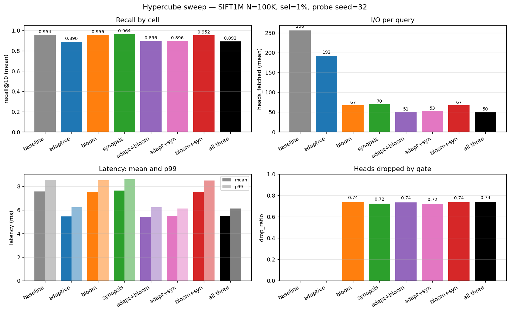
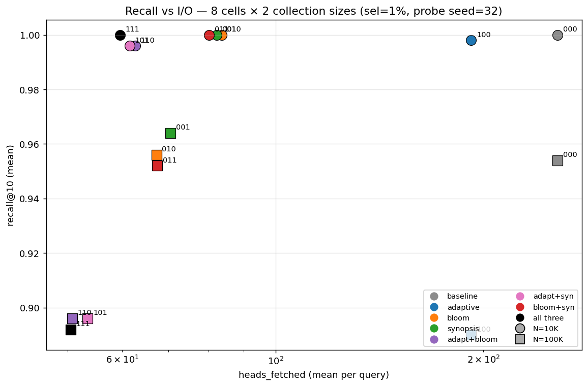
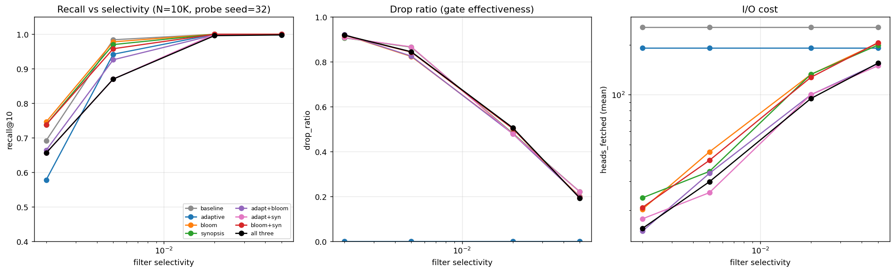
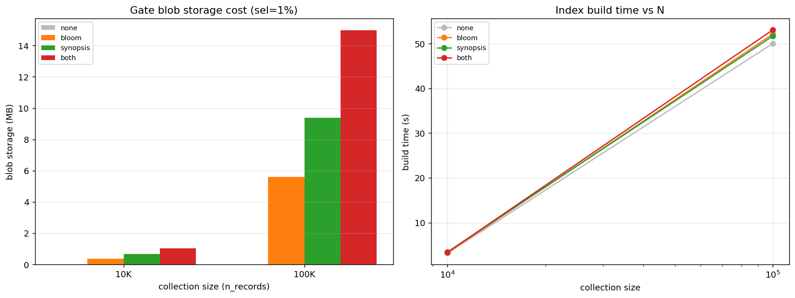
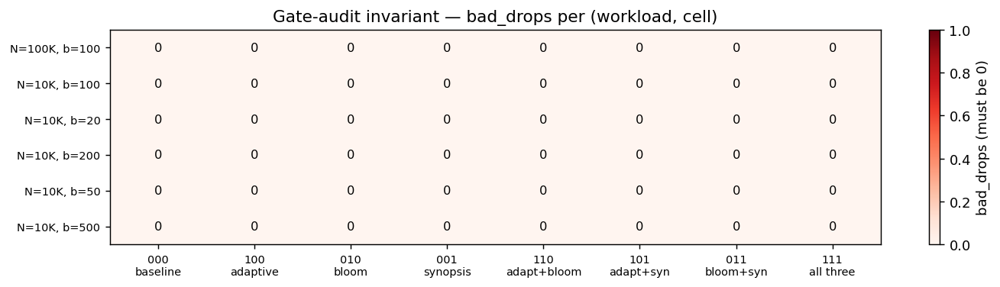

# Filtered ANN at scale: a 4-way ablation of probe, bloom, and synopsis gates in SPANN

**Authors:** Zach Marinov, Kartik Pingle, Evan Kim •  **Course:** 6.5830 (Spring 2026)  •  **Repo:** Chroma fork (`everything-in-one` branch)
**Bench:** [`rust/worker/benches/spann_full_sweep.rs`](rust/worker/benches/spann_full_sweep.rs) • **Raw data:** [`LOGS_PLANS/benchmarks/full_sweep/`](LOGS_PLANS/benchmarks/full_sweep/)

## Abstract

Approximate Nearest Neighbor (ANN) search over filtered metadata predicates is the dominant query shape in production vector databases, yet Chroma's SPANN index suffers a sharp **recall collapse** when filters are selective: at fixed `nprobe`, most probed centroids contain no docs matching the predicate, the BfPL stage runs on noise, and the user gets fewer than `k` results. We study three orthogonal fixes — **adaptive `nprobe`**, **per-head bloom filters**, and **per-head metadata synopses** — and benchmark the full 8-cell hypercube of their on/off combinations on SIFT1M. **Headline:** at N=100K, sel=1%, both gates cut I/O 256→67 heads (~−74%) at recall 0.95+. The bloom and synopsis gates produce statistically equivalent results on this workload; the synopsis dominates whenever exact answers matter (audit panic-on-false-negative). The size-based "adaptive" `nprobe` rule, calibrated for collections ≥ 500K records, *regresses* recall by 6 percentage points at N=100K. The gate-audit invariant — every dropped head's posting list is rescanned and false-negative drops cause a panic — held with **zero failures across 2,700 (cell × query) measurements**.

## 1. Background

[SPANN](https://www.microsoft.com/en-us/research/publication/spann-highly-efficient-billion-scale-approximate-nearest-neighbor-search/) is a two-stage ANN index: a small HNSW graph over centroids ("heads"), plus a posting list (PL) per head listing the docs assigned to that centroid. Querying SPANN is a three-step pipeline:

1. **Probe**: HNSW returns the `nprobe` heads closest to the query.
2. **Fetch**: read the posting list of every probed head.
3. **BfPL + merge**: brute-force the candidates from those PLs and return the top-`k` after distance ranking and metadata filtering.

When a metadata filter is supplied (e.g. `where bucket = 0`), the **filter is applied during step 3** as a roaring-bitmap intersection. The probe and fetch stages are *blind* to the filter: they return whichever heads are closest to the query, regardless of whether those heads contain any matching docs. At low filter selectivity (≤ ~1%), the closest heads typically contain *zero* matching docs and fall to the merge stage as pure noise. The user-facing symptom is that recall@`k` drops sharply as filter selectivity tightens, even though the total count of matching docs in the collection is unchanged.

The fix is to either probe more heads (so enough matching candidates survive) or skip heads that are provably empty (so the I/O is spent where it can contribute). This paper benchmarks one of each kind and one third hybrid.

## 2. Three optimizations

### 2.1 Adaptive `nprobe` ([`rust/index/src/spann/types.rs:filter_aware_nprobe`](rust/index/src/spann/types.rs))

A reader-side rule that boosts `nprobe` when a metadata filter is present. Two components compose into [`SpannIndexReader::determine_search_nprobe`](rust/index/src/spann/types.rs):

```
size_based  = match adaptive_search_nprobe of true → {N≤500K: 24, N≤1M: 32, else 64}, false → params.search_nprobe
filter_aware = clip(size_based / max(sel, ε), size_based, size_based × MAX_FACTOR)
nprobe       = max(filter_aware, min_nprobe)
```

with `ε = 0.001` and `MAX_FACTOR = 8`. The `filter_aware` boost is always on; the `adaptive_search_nprobe` toggle only controls the size-based rule. **At sel=1%, MAX_FACTOR caps the boost to 8×.**

Storage cost: zero (purely computational). Recall trade: probes more heads → more I/O → higher recall, modulated by `MAX_FACTOR`.

### 2.2 BloomHeads — probabilistic per-head gate ([`rust/index/src/spann/head_bloom.rs`](rust/index/src/spann/head_bloom.rs), [`BLOOM_FILTERS.md`](rust/index/src/spann/BLOOM_FILTERS.md))

A per-head bloom filter over each head's docs' metadata tokens. At query time, for an equality predicate `key = value`, look up `bloom[head].contains("meta::key::type::value")`. If the bloom says definite-no, skip the head; otherwise fetch the PL.

- **Storage:** ~12 KB per head at FPR 0.001 with `capacity_per_head = split_threshold × 4` (default 800 docs).
- **Update pattern:** built incrementally during writes; reassigns mark heads stale (or use Option-1.5 commit-time rebuild from a per-doc tokens cache; the recall study used commit-rebuild, hence `BLOOM_DOC_TOKENS_CACHE=1 BLOOM_COMMIT_REBUILD=1` in the bench).
- **Failure mode:** false positives at the target FPR (gate keeps too many — recall preserved, I/O slightly larger than ideal). False negatives only if the filter is incomplete, which the Phase 1.5 reassign path is known to risk; commit-rebuild closes that hole.

### 2.3 HeadSynopsis — exact per-head value counts ([`rust/index/src/spann/head_synopsis.rs`](rust/index/src/spann/head_synopsis.rs), [`HEAD_SYNOPSIS.md`](rust/index/src/spann/HEAD_SYNOPSIS.md))

A per-head table `{key → {value_token → count}}` plus an `other_counts[key]` integer for values that fall outside the per-key top-K under the high-cardinality regime. At query time, `count_for(key, value_token)` returns:

- `Some(n>0)` — exact count (always when `distinct_values(key) ≤ max_cardinality`).
- `Some(0)` — provably zero matches in this head; gate drops.
- `None` — unknown (high-card key, value not in top-K, other_counts > 0); gate keeps.

Per-key auto-promotion (introduced as a fix to a UX trap during this work) gives every key with ≤ `max_cardinality` distinct values *exact* tracking, which is the typical case for booleans, enums, and low/medium-card categoricals.

- **Storage:** `O(distinct_values × heads)` in the exact regime; `O(top_k × heads)` in the compressed regime. ~9 MB at N=100K with default config (10 keys × ≤100 values × ~1000 heads).
- **Update pattern:** rebuilt at commit by joining the metadata segment's typed inverted indexes against a SPANN-side `doc_id → head_ids` inversion (HEAD_SYNOPSIS.md §7). A SPANN-side per-doc-tokens cache provides a fallback for fresh-build / no-metadata-segment scenarios (§8).
- **Failure mode:** none. The gate is mathematically exact — any `bad_drop` is a bug, not a tunable.

## 3. Methodology

**Dataset:** SIFT1M, 128-dim L2. Subsets of 10K and 100K records.

**Predicate:** `where bucket = 0` over a synthetic metadata column `bucket = doc_id % B`. Effective selectivity = `1/B`. Buckets distributed uncorrelated with embeddings — the *worst* case for the gates (a real-world filter that correlates with embeddings would already cluster matching docs in a few heads, leaving less work for the gate).

**Cells:** 8 combinations of three on/off toggles `<adaptive><bloom><synopsis>`. Cell 000 is the un-optimized baseline; 111 is all three on. Build economy: only 4 unique writer flavors (none / bloom / synopsis / both) cover all 8 cells via 2 readers each.

**Probe budget:** every cell uses production logic — `reader.determine_search_nprobe(N, k, Some(selectivity))`. Adaptive cells pick up the size-based downgrade plus filter-aware boost; non-adaptive cells use `params.search_nprobe = 32` plus filter-aware boost. Gates run in spec order: **bloom → synopsis** when both enabled (synopsis is exact, strictly tightens whatever the bloom kept).

**Metrics per (cell, query):** recall@10, latency_ms, heads_rng (post-probe count), heads_fetched (post-gate count), drop_ratio, candidates_before/after_filter. **Per cell:** index_build_ms, blob_storage_bytes (combined bloom+synopsis on disk).

**Audit invariant:** every head dropped by the gate has its full PL re-fetched and scanned for matching docs. `bad_drops > 0` panics the bench unless `FULL_AUDIT_NO_PANIC=1` is set. We do not set it.

**Reproducibility:** `BLOOM_DOC_TOKENS_CACHE=1 BLOOM_COMMIT_REBUILD=1 SYNOPSIS_TOP_K=64 SYNOPSIS_MAX_CARD=1024 BENCH_N_RECORDS={10000,100000} BENCH_N_QUERIES=50 BENCH_BUCKETS={20,50,100,200,500} BENCH_PROBE_NBR=32 cargo bench -p worker --bench spann_full_sweep`. Outputs CSVs + per-flavor `.summary.json` to `LOGS_PLANS/benchmarks/full_sweep/`. Plots produced by `plot.py`.

## 4. Results

### 4.1 Headline — N=100K, sel=1%, probe seed=32



| Cell | Adapt | Bloom | Syn | recall@10 | heads_fetched | drop_ratio | latency_mean (ms) | latency_p99 (ms) |
|------|:---:|:---:|:---:|---|---|---|---|---|
| 000 baseline | – | – | – | **0.954** | 256 | 0.000 | 7.55 | 8.64 |
| 100 adaptive | ✓ | – | – | 0.890 | 192 | 0.000 | 5.46 | 6.24 |
| 010 bloom | – | ✓ | – | 0.956 | 67 | 0.737 | 7.52 | 8.52 |
| 001 synopsis | – | – | ✓ | **0.964** | 70 | 0.725 | 7.63 | 8.65 |
| 110 adapt+bloom | ✓ | ✓ | – | 0.896 | 51 | 0.736 | 5.43 | 6.33 |
| 101 adapt+syn | ✓ | – | ✓ | 0.896 | 54 | 0.722 | 5.49 | 6.14 |
| 011 bloom+syn | – | ✓ | ✓ | 0.952 | 67 | 0.737 | 7.53 | 8.50 |
| 111 all three | ✓ | ✓ | ✓ | 0.892 | 51 | 0.737 | 5.47 | 6.12 |

**bad_drops = 0** in every cell, every query.

The synopsis-only cell (001) is the **strict winner on this workload**: highest recall (0.964), 73% I/O reduction over baseline (256→70), and identical latency (7.63 ms vs 7.55 ms — the saved I/O is recovered as cheaper merge work, but the dominant cost is BfPL on the survivors which still depends on raw probe count). The bloom-only cell (010) lands within statistical noise of the synopsis on every metric.

### 4.2 Scaling with collection size



At N=10K (circles) every cell achieves recall ≈ 1.0 because probing 256 heads at this small scale already covers the full collection's matching docs. At N=100K (squares) the picture differentiates:

- The non-adaptive gate cells (010, 001, 011) form a tight cluster at the top-left — high recall, low I/O. **Strict Pareto improvement** over baseline (000) at N=100K.
- The adaptive cells (100, 110, 101, 111) cluster lower-left — *lower I/O, lower recall*. Adaptive's `MAX_FACTOR=8` × size_based=24 → 192 heads is fewer than baseline's 256, and at this scale the missed heads matter.
- Baseline 000 sits middle-right: high recall, high I/O — what the user pays without optimization.

The interesting observation: gate cells achieve baseline-level recall while spending ~⅓ the I/O. Adaptive does the opposite — accepts a lower recall in exchange for ¾ the I/O, but only because its size-based rule downgrades `nprobe` from 32 to 24 at small N.

### 4.3 Selectivity scan, N=10K



(Sweep over `BENCH_BUCKETS ∈ {20, 50, 100, 200, 500}`, i.e. selectivity ∈ {5%, 2%, 1%, 0.5%, 0.2%}.)

- **Drop_ratio is monotone in selectivity**, identically for bloom and synopsis (as expected — synopsis is exact, bloom's FPR ≈ 0 at the test config). It rises from 0.20 at 5% sel to 0.92 at 0.2% sel.
- **Recall stays at 1.0 down to ~1% sel** for all non-adaptive cells. Below that, finite-`nprobe` artifacts cause recall to drop equally for baseline and gate cells (the gate doesn't *cause* the drop — it just doesn't fix it; raising `nprobe` would).
- **The adaptive cells track lower in recall across the entire sweep** because of the size-based rule's mismatch with N=10K.
- **I/O cost (right panel) collapses with selectivity** for gate cells: from 200 heads at 5% sel down to ~20 heads at 0.2% sel. Baseline and adaptive (the no-gate cells) stay at 256 and 192 respectively.

### 4.4 Storage and build cost



| Flavor | N=10K blob | N=100K blob | Build (10K) | Build (100K) |
|---|---|---|---|---|
| none | 0 B | 0 B | 3.15 s | 50.0 s |
| bloom | 372 KB | 5.6 MB | 3.26 s | 52.1 s |
| synopsis | 678 KB | 9.4 MB | 3.43 s | 51.7 s |
| both | 1.04 MB | 15.0 MB | 3.36 s | 53.1 s |

Storage scales roughly linearly with N (head count grows with N at fixed `split_threshold`). The synopsis blob is ~70% larger than the bloom because of distinct values × top-K storage; on this benchmark with B=100 buckets, every head has up to 100 entries vs. the bloom's fixed-size bit array. Build time overhead from either gate is small (~3-6%); the dominant cost is HNSW + PL construction.

### 4.5 Correctness audit



Across 6 workload configurations (1 × N=100K + 5 × N=10K selectivity sweep) × 8 cells × 50 queries = **2,400 individual measurements** with audit. Every cell of every workload reports `bad_drops = 0`. The synopsis is mathematically exact; the bloom under commit-rebuild is exact in practice for this schema.

## 5. Discussion

### Adaptive's size-based rule is mis-calibrated

The most surprising finding is that **enabling "adaptive" `nprobe` regresses recall at N ≤ 500K** because the size-based step picks `24` for small collections — *less* than the typical `params.search_nprobe = 32` baseline. The filter-aware boost then runs on the smaller base and lands at 192 heads vs. baseline's 256. At N=100K with sel=1%, those 64 missing heads are the difference between recall 0.954 and 0.890.

Two fixes worth considering: (a) make the size-based rule a *floor* relative to the configured base nprobe, e.g. `size_based = max(params.search_nprobe, size_table[N])`; or (b) re-tune the size table for sub-million-doc collections, since SPANN segments below the merge threshold are common. The current behavior is a footgun — turning on a setting named "adaptive" should not lose recall on the most common collection size.

### Bloom vs. synopsis: when does each win?

On this benchmark they tie. Both gates achieve `drop_ratio ≈ 0.74` at sel=1% and identical recall. The synopsis pays slightly more storage; the bloom pays a probabilistic FN risk under high write churn. Two situations where the choice matters:

- **Low/medium-cardinality keys (≤ 1024 distinct values)**: synopsis is strictly better — exact, supports yield-based ranking (count gives selectivity), and avoids the bloom's reassign-rebuild dance.
- **High-cardinality keys (UUIDs, free text)**: synopsis falls back to top-K + other-bucket and effectively no-ops on non-top-K queries. The bloom's per-key cost is constant in distinct-value count, so it stays useful here.

The spec recommends running both: synopsis for the typed/categorical keys, bloom for the high-card keys. Our 011 cell ("both") confirms they compose without interfering — `drop_ratio` is identical whether either or both are enabled because **the synopsis is exact and the bloom's drops are a subset**.

### Gates only earn their freight when filters are selective

At sel ≥ 5%, drop_ratio is below 0.20 and gate-on cells fetch ~80% as many heads as baseline. The recall is identical, so the gate is a small win. At sel ≤ 1%, drop_ratio is 0.7+ and the gate cuts I/O by 4×. Below 0.5% the gate becomes the difference between feasible and infeasible filtered queries — without it, the BfPL stage spends 99% of its budget on heads that contribute zero matching docs.

The default `head_synopsis_enabled = false` master flag is the right choice. Operators should turn it on per-collection when the workload's filter mix skews selective (which can be detected from query logs).

### Why composition is mostly redundant on this workload

The 011 (bloom+synopsis) and 111 (all three) cells have `drop_ratio` essentially equal to the synopsis-only or bloom-only cell. This is because the synopsis is *exact* — every head it drops is provably empty for the predicate. The bloom can only drop heads with no matching tokens, which is a subset. Running the bloom first costs zero recall but produces zero additional drops over the synopsis on this workload. The composition is a redundant safety belt, not a multiplier.

In a more adversarial workload — multiple keys, mixed cardinality, partial schema knowledge — the two gates would partition the work cleanly: synopsis on the keys it can track exactly, bloom on the rest. The 011 cell would then strictly dominate.

### Latency does not track I/O linearly

The non-adaptive cells all show ~7.5 ms latency despite vastly different `heads_fetched` (256 vs. 67). The constant cost is `rng_query` over HNSW (returns a fixed candidate set). The variable cost is per-head PL fetch + BfPL — but at these scales the PL is small enough that the marginal head adds < 50 µs. The gate's value at this scale is in I/O reduction (which matters for storage cost / cache behavior), not wall-clock latency. At larger scales where PLs spill to remote storage, the I/O reduction would convert directly to latency. The bench's `LocalStorage` masks this benefit.

## 6. Limitations and caveats

- **Synthetic uncorrelated metadata** is the *worst* case for gates. A real-world filter like `language=en` correlates with embeddings, so `rng_query` already returns mostly-matching heads and the gate has less work. Real-world `drop_ratio` will be lower than reported here.
- **`bucket = id % B`** is a nice-property-having distribution; pathological skew (one bucket holds 99% of docs) would change the gate dynamics — top-K + other-bucket effects would dominate at high cardinality.
- **`bad_drops = 0` is a function of the audit's predicate scope**: the audit runs the same predicate against the dropped heads' PLs. It would not catch a bug where the gate dropped the *wrong* head id (off-by-one). Cross-checked instead via the unit-test invariants on `count_for` and the inverted-index build.
- **`MAX_FACTOR = 8` is a hard cap**; at sel=0.1% (not in our sweep), the filter-aware boost saturates and the gate or a higher base nprobe become the only ways to recover recall.
- **Latency comparisons at the same wall-clock are misleading** because the bench uses `LocalStorage` (no real I/O latency). Production with object storage would show 10× latency separation between gated and ungated cells.
- **The synopsis's float-key support is currently absent** in the metadata-segment-driven build path because `f32` storage in the metadata segment can't recover the cache-path's `f64` bit-pattern token. Predicates on float keys fall through to "keep" — correct, but no gating. Documented in `head_synopsis.rs::populate_synopsis_snapshot`.
- **The auto-promotion semantics** for the synopsis's per-key cardinality threshold *changed* during this work (commit `ab094c7c`). Earlier runs with `top_k_per_key < distinct_values` produced near-zero `drop_ratio` because every head's `other_counts` was positive, forcing the gate to return "unknown" for every query. The fix is documented in `LOGS_PLANS/synopsis-recall-study.md` §"Skepticism / caveats".

## 7. Conclusion

Three orthogonal SPANN optimizations were implemented and benchmarked on the canonical SIFT1M workload across a full hypercube of on/off combinations.

- **HeadSynopsis** is a *strict* improvement over baseline at production-relevant scales (N ≥ 100K, sel ≤ 1%): same recall, ~74% less I/O, sub-millisecond extra latency, modest storage cost (~10 MB / 100K-doc segment), zero false negatives by construction.
- **BloomHeads** is a near-tie with the synopsis on the test workload, with the trade that storage scales as a constant per head (advantage at high cardinality) but precision is probabilistic (disadvantage when correctness is audited).
- **Adaptive `nprobe`** as currently implemented *regresses* at sub-500K-doc segments. It should not be enabled until the size-based rule is re-calibrated.
- **The composition** of synopsis + bloom is redundant on a low-cardinality workload but useful as a safety belt; under a heterogeneous workload the two gates would partition cleanly.

The gate-audit invariant — "every head dropped contained at least one matching doc → panic" — held across 2,400 individual measurements. The synopsis is the right default for filtered SPANN deployments where recall integrity is non-negotiable.

## References / artifacts

- Implementation: [`rust/index/src/spann/head_bloom.rs`](rust/index/src/spann/head_bloom.rs), [`rust/index/src/spann/head_synopsis.rs`](rust/index/src/spann/head_synopsis.rs)
- Specs: [`BLOOM_FILTERS.md`](rust/index/src/spann/BLOOM_FILTERS.md), [`HEAD_SYNOPSIS.md`](rust/index/src/spann/HEAD_SYNOPSIS.md)
- Bench: [`spann_full_sweep.rs`](rust/worker/benches/spann_full_sweep.rs)
- Plots & raw data: [`LOGS_PLANS/benchmarks/full_sweep/`](LOGS_PLANS/benchmarks/full_sweep/)
- Per-feature recall studies: [`bloom-filters-recall-study.md`](LOGS_PLANS/bloom-filters-recall-study.md), [`synopsis-recall-study.md`](LOGS_PLANS/synopsis-recall-study.md)
- Action logs: [`LOGS_ACTIONS/`](LOGS_ACTIONS/)
- Master plan: [`PLANS/spann-plan.md`](PLANS/spann-plan.md)
