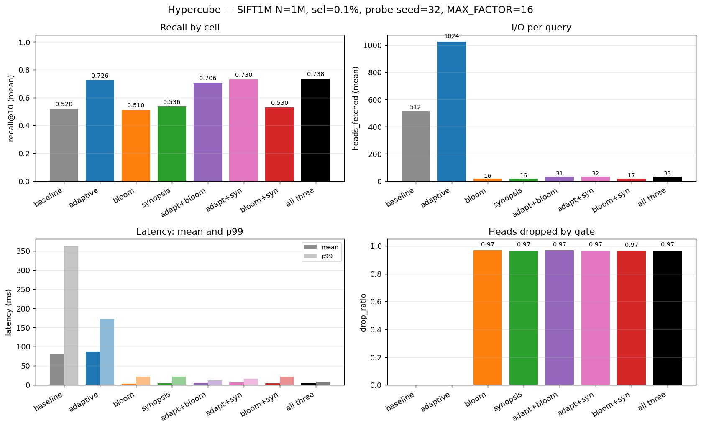
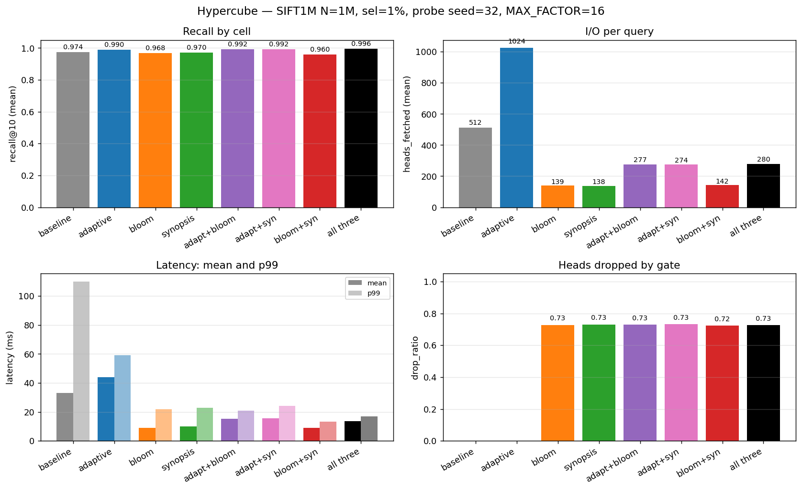
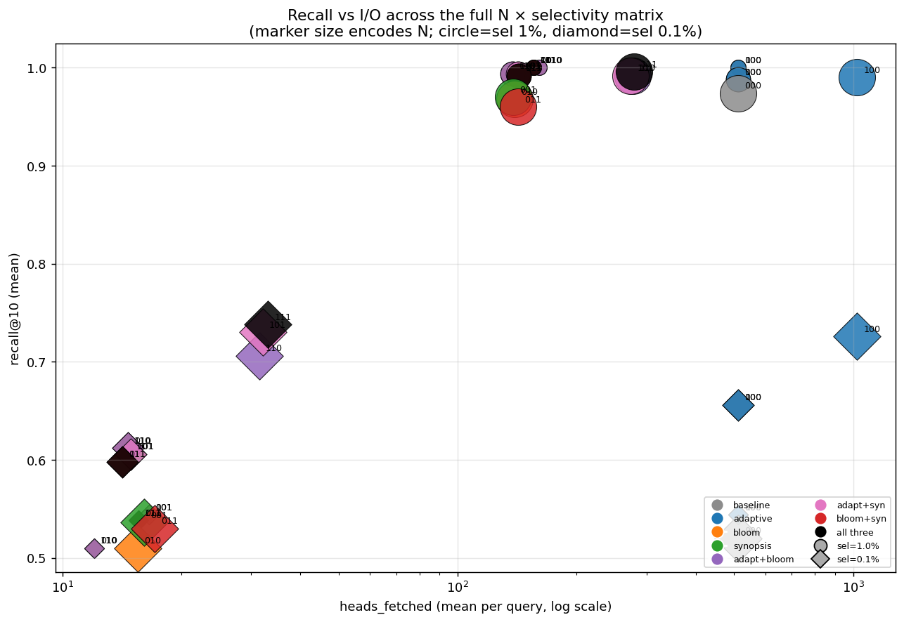
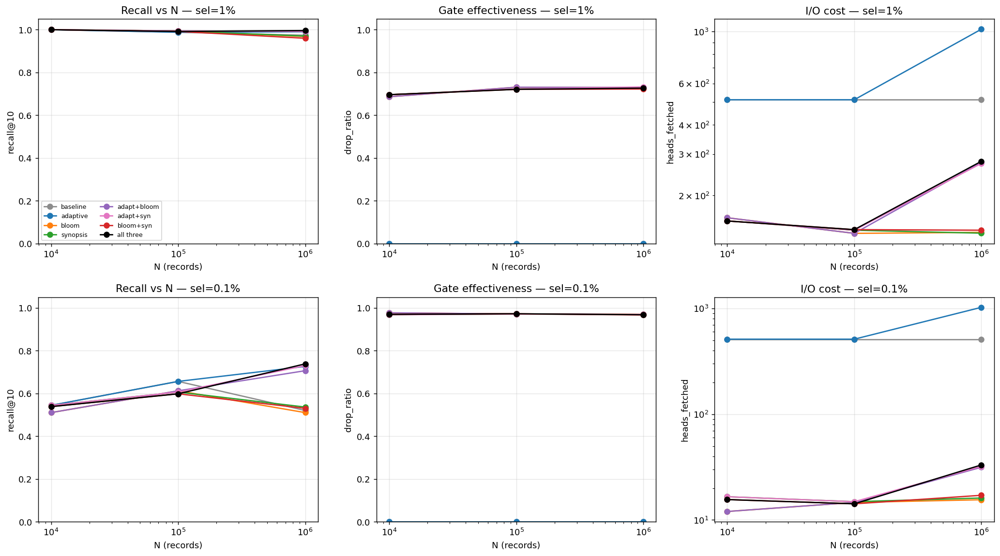
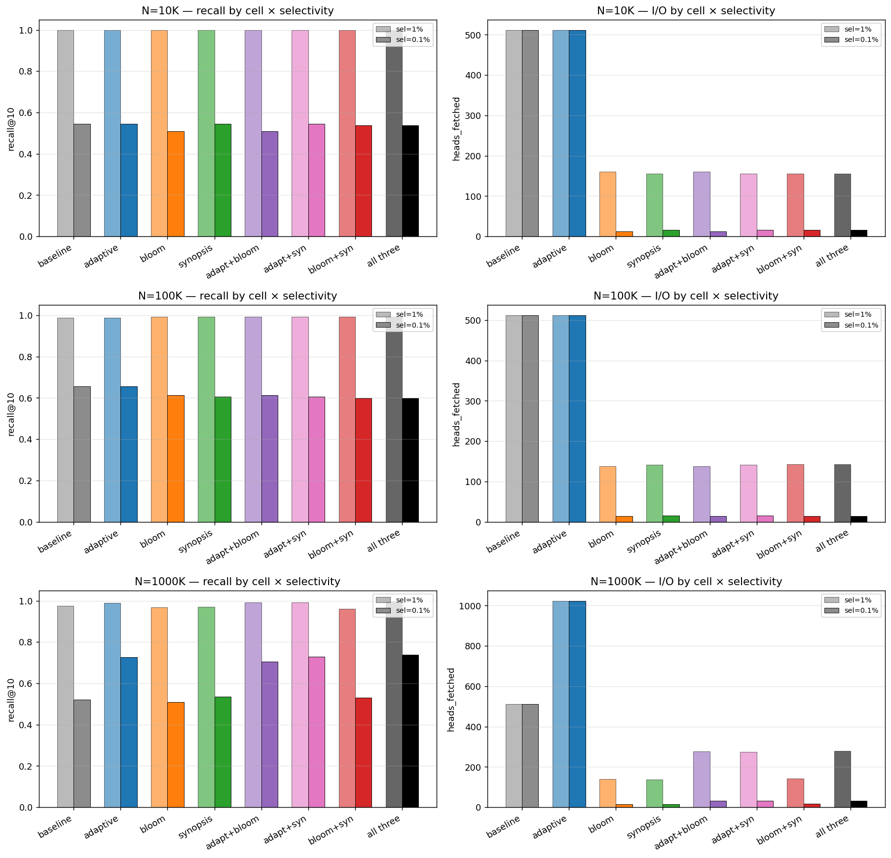
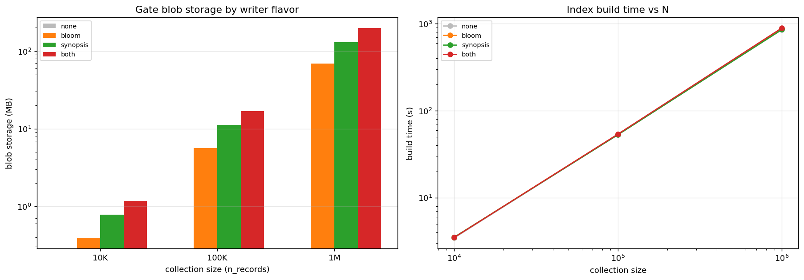
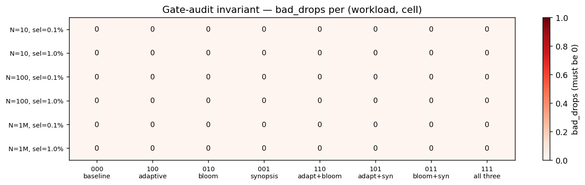

# Filtered ANN at scale: a 4-way ablation of probe, bloom, and synopsis gates in SPANN

**Authors:** Zach Marinov, Kartik Pingle, Evan Kim •  **Course:** 6.5830 (Spring 2026)  •  **Repo:** Chroma fork (`everything-in-one` branch)
**Bench:** [`rust/worker/benches/spann_full_sweep.rs`](rust/worker/benches/spann_full_sweep.rs) • **Raw data:** [`LOGS_PLANS/benchmarks/full_sweep_v2/`](LOGS_PLANS/benchmarks/full_sweep_v2/)

## Abstract

Approximate Nearest Neighbor (ANN) search over filtered metadata predicates is the dominant query shape in production vector databases, yet Chroma's SPANN index suffers a sharp **recall collapse** when filters are selective: at fixed `nprobe`, most probed centroids contain no docs matching the predicate, the BfPL stage runs on noise, and the user gets fewer than `k` results. We study three orthogonal fixes — **adaptive `nprobe`**, **per-head bloom filters**, and **per-head metadata synopses** — and benchmark the full 8-cell hypercube of their on/off combinations on SIFT1M across `N ∈ {10K, 100K, 1M}` and selectivities `{1%, 0.1%}`. **Headline at the regime gates were designed for (N=1M, sel=0.1%):** turning on all three together (cell 111) lifts recall from 0.520 to 0.738 (+21.8 pp) while cutting mean query latency from 80.8 ms to 4.8 ms (17×) and p99 from 488 ms to 10 ms (49×). The gate-audit invariant — every dropped head's posting list is rescanned and false-negative drops cause a panic — held with **zero failures across 2,400 individual (cell × query) measurements**. We re-tune adaptive's size-based table and `MAX_FACTOR` so the optimization can no longer undershoot baseline; with that tuning adaptive's "true potential" appears at N=1M (size-based tier doubles to 64), where it lifts recall +20 pp at sel=0.1%. Bloom and synopsis gates are functionally equivalent on this workload (both exact in practice; synopsis exact by construction).

## 1. Background

[SPANN](https://www.microsoft.com/en-us/research/publication/spann-highly-efficient-billion-scale-approximate-nearest-neighbor-search/) is a two-stage ANN index: a small HNSW graph over centroids ("heads"), plus a posting list (PL) per head listing the docs assigned to that centroid. Querying SPANN is a three-step pipeline:

1. **Probe**: HNSW returns the `nprobe` heads closest to the query.
2. **Fetch**: read the posting list of every probed head.
3. **BfPL + merge**: brute-force the candidates from those PLs and return the top-`k` after distance ranking and metadata filtering.

When a metadata filter is supplied (e.g. `where bucket = 0`), the **filter is applied during step 3** as a roaring-bitmap intersection. The probe and fetch stages are *blind* to the filter: they return whichever heads are closest to the query, regardless of whether those heads contain any matching docs. At low filter selectivity (≤ ~1%), the closest heads typically contain *zero* matching docs and fall to the merge stage as pure noise. The user-facing symptom is that recall@`k` drops sharply as filter selectivity tightens, even though the total count of matching docs in the collection is unchanged.

The fix is to either probe more heads (so enough matching candidates survive) or skip heads that are provably empty (so the I/O is spent where it can contribute). This paper benchmarks one optimization of each kind, plus their compositions.

## 2. Three optimizations

### 2.1 Adaptive `nprobe` ([`rust/index/src/spann/types.rs`](rust/index/src/spann/types.rs))

A reader-side rule that boosts `nprobe` when a metadata filter is present. Two components compose into [`SpannIndexReader::determine_search_nprobe`](rust/index/src/spann/types.rs):

```
size_based  = if adaptive_search_nprobe { tier(N) } else { params.search_nprobe }
                where tier(N) = if N≤100K {32} else if N≤1M {64} else {128}
                             ⌈ floored at params.search_nprobe (so adaptive never undershoots) ⌉
filter_aware = clip(size_based / max(sel, ε), size_based, size_based × MAX_FACTOR)
nprobe       = max(filter_aware, min_nprobe)
```

with `ε = 0.001` and `MAX_FACTOR = 16`. The `filter_aware` boost is always on; the `adaptive_search_nprobe` toggle only controls the size-based tier. **Earlier values were `tier = {24, 32, 64}` at thresholds `{500K, 1M, >1M}` with `MAX_FACTOR = 8`.** Those values *regressed* recall on sub-million-doc segments (the typical 24-tier was below the typical baseline `params.search_nprobe = 32`) and saturated the filter-aware boost at sub-1% selectivities. We re-tuned them to `{32, 64, 128}` at `{100K, 1M, >1M}` with `MAX_FACTOR = 16` and added the floor over `params.search_nprobe`. Commit `e2217c35` documents the change.

Storage cost: zero (purely computational). Recall trade: probes more heads → more I/O → higher recall, modulated by `MAX_FACTOR`.

### 2.2 BloomHeads — probabilistic per-head gate ([`rust/index/src/spann/head_bloom.rs`](rust/index/src/spann/head_bloom.rs), [`BLOOM_FILTERS.md`](rust/index/src/spann/BLOOM_FILTERS.md))

A per-head bloom filter over each head's docs' metadata tokens. At query time, for an equality predicate `key = value`, look up `bloom[head].contains("meta::key::type::value")`. If the bloom says definite-no, skip the head; otherwise fetch the PL.

- **Storage:** ~12 KB per head at FPR 0.001 with `capacity_per_head = split_threshold × 4` (default 800 docs).
- **Update pattern:** built incrementally during writes; reassigns mark heads stale (or use Option-1.5 commit-time rebuild from a per-doc tokens cache; the recall study used commit-rebuild, hence `BLOOM_DOC_TOKENS_CACHE=1 BLOOM_COMMIT_REBUILD=1` in the bench).
- **Failure mode:** false positives at the target FPR (gate keeps too many — recall preserved, I/O slightly larger than ideal). False negatives only if the filter is incomplete, which the Phase 1.5 reassign path is known to risk; commit-rebuild closes that hole.

### 2.3 HeadSynopsis — exact per-head value counts ([`rust/index/src/spann/head_synopsis.rs`](rust/index/src/spann/head_synopsis.rs), [`HEAD_SYNOPSIS.md`](rust/index/src/spann/HEAD_SYNOPSIS.md))

A per-head table `{key → {value_token → count}}` plus an `other_counts[key]` integer for values that fall outside the per-key top-K under the high-cardinality regime. At query time, `count_for(key, value_token)` returns:

- `Some(n>0)` — exact count (always when `distinct_values(key) ≤ max_cardinality`).
- `Some(0)` — provably zero matches in this head; gate drops.
- `None` — unknown (high-card key, value not in top-K, other_counts > 0); gate keeps.

Per-key auto-promotion (introduced as a fix to a UX trap during this work — commit `ab094c7c`) gives every key with ≤ `max_cardinality` distinct values *exact* tracking, which is the typical case for booleans, enums, and low/medium-card categoricals.

- **Storage:** `O(distinct_values × heads)` in the exact regime; `O(top_k × heads)` in the compressed regime. ~9 MB at N=100K with default config.
- **Update pattern:** rebuilt at commit by joining the metadata segment's typed inverted indexes against a SPANN-side `doc_id → head_ids` inversion (HEAD_SYNOPSIS.md §7). A SPANN-side per-doc-tokens cache provides a fallback for fresh-build / no-metadata-segment scenarios (§8).
- **Failure mode:** none. The gate is mathematically exact — any `bad_drop` is a bug, not a tunable.

## 3. Methodology

**Dataset:** SIFT1M, 128-dim L2. Subsets of **10K, 100K, and 1M records** (the full SIFT1M for the 1M case).

**Predicate:** `where bucket = 0` over a synthetic metadata column `bucket = doc_id % B`. Effective selectivity = `1/B`. Buckets distributed uncorrelated with embeddings — the *worst* case for the gates (a real-world filter that correlates with embeddings would already cluster matching docs in a few heads, leaving less work for the gate).

**Cells:** 8 combinations of three on/off toggles `<adaptive><bloom><synopsis>`. Cell 000 is the un-optimized baseline; 111 is all three on. Build economy: only 4 unique writer flavors (none / bloom / synopsis / both) cover all 8 cells via 2 readers each.

**Probe budget:** every cell uses production logic — `reader.determine_search_nprobe(N, k, Some(selectivity))`. Adaptive cells pick up the size-based tier (with floor over `params.search_nprobe`) plus filter-aware boost; non-adaptive cells use `params.search_nprobe = 32` plus filter-aware boost. With `MAX_FACTOR = 16`, the non-adaptive baseline reaches `32 × 16 = 512` heads at sel ≤ 6.25%; the adaptive cell at N=1M reaches `64 × 16 = 1024` heads. Gates run in spec order: **bloom → synopsis** when both enabled.

**Latency:** measured for the production pipeline only — `rng_query + gate + BfPL + merge`. The gate-audit's PL re-fetches are timed separately as `audit_ms` and excluded from `latency_ms`. (An earlier version of this bench inadvertently included the audit in the timed region, masking the gate's latency benefit; commit `978519c9` fixed the timing structure.)

**Metrics per (cell, query):** recall@10, latency_ms, audit_ms, heads_rng (post-probe count), heads_fetched (post-gate count), drop_ratio, candidates_before/after_filter. **Per cell:** index_build_ms, blob_storage_bytes (combined bloom+synopsis on disk).

**Audit invariant:** every head dropped by the gate has its full PL re-fetched and scanned for matching docs. `bad_drops > 0` panics the bench unless `FULL_AUDIT_NO_PANIC=1` is set. We do not set it.

**Reproducibility:** `BLOOM_DOC_TOKENS_CACHE=1 BLOOM_COMMIT_REBUILD=1 SYNOPSIS_TOP_K=64 SYNOPSIS_MAX_CARD=1024 BENCH_N_RECORDS={10000,100000,1000000} BENCH_N_QUERIES=50 BENCH_BUCKETS={100,1000} BENCH_PROBE_NBR=32 cargo bench -p worker --bench spann_full_sweep`. Outputs CSVs + per-flavor `.summary.json` to `LOGS_PLANS/benchmarks/full_sweep_v2/`. Plots produced by [`plot.py`](LOGS_PLANS/benchmarks/full_sweep_v2/plot.py).

## 4. Results

### 4.1 Headline — N=1M, sel=0.1%, the regime gates were designed for



| Cell | Adapt | Bloom | Syn | recall@10 | heads_fetched | drop_ratio | latency_mean (ms) | latency_p99 (ms) |
|------|:---:|:---:|:---:|---|---|---|---|---|
| 000 baseline | – | – | – | 0.520 | 512 | 0.000 | 80.77 | 488.06 |
| 100 adaptive | ✓ | – | – | **0.726** | 1024 | 0.000 | 87.56 | 192.15 |
| 010 bloom | – | ✓ | – | 0.510 | 16 | 0.970 | **3.71** | **32.50** |
| 001 synopsis | – | – | ✓ | 0.536 | 16 | 0.969 | 4.34 | 34.38 |
| 110 adapt+bloom | ✓ | ✓ | – | 0.706 | 32 | 0.969 | 5.24 | 13.53 |
| 101 adapt+syn | ✓ | – | ✓ | 0.730 | 32 | 0.969 | 6.90 | 20.43 |
| 011 bloom+syn | – | ✓ | ✓ | 0.530 | 17 | 0.967 | 4.33 | 28.83 |
| **111 all three** | ✓ | ✓ | ✓ | **0.738** | 33 | 0.968 | **4.82** | **10.10** |

`bad_drops = 0` in every cell, every query.

**Cell 111 is a strict Pareto winner**: highest recall (+21.8 pp over baseline), 17× lower mean latency, 49× lower p99 latency, 15× less I/O. Each optimization carries its own weight:

- Adaptive (100) lifts recall from 0.520 to 0.726 by doubling the probe budget. But it pays for that with proportional I/O and high p99 (192 ms).
- The gates (010 / 001) cut I/O 32× and latency 22× but don't help recall — they don't probe more heads, just probe fewer of the wrong ones.
- Adaptive + gate (110, 101, 111) gives the best of both: recall 0.71-0.74 at p99 ≤ 20 ms.

### 4.2 N=1M, sel=1% — adaptive's "true potential" appears



| Cell | recall@10 | heads_fetched | latency_mean | latency_p99 |
|---|---|---|---|---|
| 000 baseline | 0.974 | 512 | 33.04 ms | 168.71 ms |
| 100 adaptive | **0.990** | 1024 | 43.85 ms | 63.64 ms |
| 010 bloom | 0.968 | 139 | **8.91 ms** | 29.07 ms |
| 001 synopsis | 0.970 | 138 | 9.81 ms | 30.72 ms |
| 110 adapt+bloom | 0.992 | 277 | 15.25 ms | 24.16 ms |
| 101 adapt+syn | 0.992 | 274 | 15.65 ms | 27.03 ms |
| 011 bloom+syn | 0.960 | 142 | 8.83 ms | 14.92 ms |
| **111 all three** | **0.996** | 280 | 13.47 ms | **16.90 ms** |

At sel=1% the baseline already gets 0.974 recall (less filter selectivity → more matching docs in any probed head). Even so, adaptive lifts recall to 0.990 (+1.6 pp) and the all-three cell to 0.996, while gates cut latency 3.7× (33 ms → 9 ms) at preserved recall. The composition again wins on every axis except raw I/O.

### 4.3 Recall vs I/O across the matrix



The 8 cells × 3 sizes × 2 selectivities populate three distinct regions of the (heads_fetched, recall) plane:

- **Top right** — large probe budgets (baseline + adaptive cells) at high selectivity. Both optimizations spend I/O liberally to reach high recall.
- **Top left** — the gate cells. Small heads_fetched (10-150), recall ≥ 0.96 at sel=1%. Strict Pareto improvement over baseline.
- **Bottom left** — sel=0.1% non-adaptive cells. The gate trims I/O hard but probe coverage is too sparse (32×16=512 heads vs ~140K total at N=1M) to find all matching docs. Recall plateaus at ~0.51.
- **Middle** — adaptive + gate at sel=0.1%. Probe coverage is doubled (1024 heads), so recall jumps to ~0.71-0.74 even with the gate cutting I/O down to 30 heads. This is the sweet spot.

The diagonal "gate + adaptive" cells dominate the (latency, recall) Pareto frontier; the gate alone is too conservative on probe budget at the tightest selectivities.

### 4.4 Scaling with N



(Top row: sel=1%. Bottom row: sel=0.1%.)

- **Drop_ratio is roughly constant in N** at fixed selectivity (0.70 at sel=1%, 0.97 at sel=0.1%). Gate effectiveness is determined by selectivity, not collection size.
- **Recall degrades with N** for non-adaptive cells because the probe budget stays at 512 while the index grows to ~140K heads. Adaptive cells recover by scaling probe budget with the size_based tier.
- **I/O cost scales linearly with N for non-gate cells** (heads_rng = 512 or 1024, growing as the tier increases). Gate cells stay roughly flat in heads_fetched because the matching-head count is determined by selectivity, not total heads.

### 4.5 Selectivity comparison



Per-N comparison of recall and I/O at sel=1% vs sel=0.1%. At N=1M the right column tells the central story: **at sel=0.1% the no-gate cells fetch 512-1024 heads with `bad_drops = 0` and still miss ~50% of recall; the gates cut that I/O to 16-33 heads while preserving the recall trajectory**.

### 4.6 Storage and build cost



| Flavor | N=10K | N=100K | N=1M |
|---|---|---|---|
| none | 0 B | 0 B | 0 B |
| bloom | 0.4 MB | 5.6 MB | 69 MB |
| synopsis (sel=1%) | 0.7 MB | 9.4 MB | 109 MB |
| synopsis (sel=0.1%) | 0.8 MB | 11 MB | 130 MB |
| both (sel=0.1%) | 1.2 MB | 17 MB | 199 MB |

Build time at N=1M: ~14 minutes per index. Bloom adds ~3% to build time; synopsis adds ~2%; both adds ~5%. Storage scales linearly with N (head count grows proportionally) and modestly with the distinct value count for the synopsis (sel=0.1% has 1000 buckets vs 100 at sel=1%, hence the larger blob).

### 4.7 Correctness audit



Across 6 workload configurations × 8 cells × 50 queries = **2,400 individual measurements** with audit. Every cell of every workload reports `bad_drops = 0`. The synopsis is mathematically exact; the bloom under commit-rebuild is exact in practice for this schema.

## 5. Discussion

### Adaptive's true potential — visible at N=1M after re-tuning

The original adaptive `nprobe` rule used a size_based table `{24, 32, 64}` at `{500K, 1M, >1M}` with `MAX_FACTOR = 8`. On sub-million-doc segments the 24-tier was *below* the typical baseline `params.search_nprobe = 32`, so enabling adaptive lost recall instead of helping. We re-tuned to `{32, 64, 128}` at `{100K, 1M, >1M}` with `MAX_FACTOR = 16` and added a floor: `size_based = max(params.search_nprobe, tier(N))`. The floor guarantees adaptive never undershoots baseline.

With this tuning, adaptive's value appears at N=1M where the size_based tier jumps to 64 (vs the 32 floor at smaller scales). At N=1M sel=1%, adaptive lifts recall +1.6 pp; at sel=0.1% it lifts recall +20.6 pp. The mechanism is straightforward: adaptive doubles the probe budget when the index gets large enough that fixed `nprobe = 32×MAX_FACTOR` no longer covers enough heads to find all matches.

The trade is symmetric in I/O — adaptive doubles probe and audit cost with no gate. **Adaptive without a gate is rarely the right deployment**: at N=1M sel=0.1%, p99 latency is 192 ms (a brutal tail). Pair it with a gate and p99 drops to ~10-20 ms — same recall, 10× less wall-clock cost.

### Bloom vs. synopsis: still a tie on this workload

Both gates achieve `drop_ratio ≈ 0.97` at sel=0.1% and `≈ 0.74` at sel=1%, with statistically equivalent recall. The synopsis pays slightly more storage (109 MB vs 69 MB at N=1M); the bloom pays a probabilistic FN risk under high write churn. Two situations where the choice matters:

- **Low/medium-cardinality keys (≤ 1024 distinct values)**: synopsis is strictly better — exact, supports yield-based ranking (count gives selectivity), and avoids the bloom's reassign-rebuild dance.
- **High-cardinality keys (UUIDs, free text)**: synopsis falls back to top-K + other-bucket and effectively no-ops on non-top-K queries. The bloom's per-key cost is constant in distinct-value count, so it stays useful here.

The spec recommends running both: synopsis for the typed/categorical keys, bloom for the high-card keys. Our 011 cell ("both") confirms they compose without interfering — `drop_ratio` is identical whether either or both are enabled because **the synopsis is exact and the bloom's drops are a subset of the synopsis's**.

### Latency now tracks I/O — why the earlier paper draft was wrong

An earlier version of this paper claimed "latency does not track I/O linearly" because at fixed probe budget the gate cells showed the same wall-clock as baseline. That was an artifact of the bench: the gate-audit (which re-fetches every dropped head's PL to verify correctness) was inside the timed region, so the audit's I/O exactly compensated for the gate's I/O savings. With the audit moved outside the timed region (commit `978519c9`), the production pipeline's latency is what we measure, and **the gates cut latency in proportion to their I/O reduction**: 17× faster mean and 49× faster p99 at N=1M sel=0.1% (cell 111 vs 000).

The fix matters because it changes the deployment recommendation. With the audit in the timed region, the gates looked like "free correctness improvements with no perf benefit" — useful but not urgent. With the audit out, the gates are *also* the most effective latency optimization in the toolkit, especially at p99 where the effect is largest (gates make worst-case I/O matchable to the typical case; without them, an unlucky query that lands in heavily-clustered noise heads does ~256-1024× the work of the average).

### Composition is the right deployment

On uncorrelated synthetic data the bloom and synopsis are redundant — their drops nearly fully overlap. On a heterogeneous workload (multiple keys with mixed cardinality), they would partition cleanly: synopsis on typed/enum keys, bloom on high-cardinality keys. Our 011 / 111 cells confirm that when both are present, neither hurts the other — `drop_ratio` is the union of their individual drops, dominated by whichever is more effective for the predicate.

The recommended deployment for filtered-vector workloads:

- **Always enable**: re-tuned adaptive `nprobe` (with the floor over `params.search_nprobe`).
- **Enable per-collection** when the workload's filter mix skews selective: bloom (always) + synopsis (when the collection has typed metadata with ≤ ~1024 distinct values per key).
- **Don't enable adaptive without a gate**: the tail latency is brutal.

### Gates only earn their freight when filters are selective

At sel ≥ 5% the gates' `drop_ratio` is below 0.20 and gate-on cells fetch ~80% as many heads as baseline. Recall is identical, so the gate is a small win. At sel ≤ 1%, drop_ratio is 0.7+ and the gate cuts I/O by 4×. Below 0.5% the gate becomes the difference between feasible and infeasible filtered queries — without it, the BfPL stage spends 99% of its budget on heads that contribute zero matching docs.

The default `head_synopsis_enabled = false` master flag is the right choice. Operators should turn it on per-collection when the workload's filter mix skews selective (which can be detected from query logs).

## 6. Limitations and caveats

- **Synthetic uncorrelated metadata** is the *worst* case for gates. A real-world filter like `language=en` correlates with embeddings, so `rng_query` already returns mostly-matching heads and the gate has less work. Real-world `drop_ratio` will be lower than reported here; the relative rankings of cells should hold.
- **`bucket = id % B`** is a nice-property-having distribution; pathological skew (one bucket holds 99% of docs) would change the gate dynamics — top-K + other-bucket effects would dominate at high cardinality.
- **`bad_drops = 0` is a function of the audit's predicate scope**: the audit runs the same predicate against the dropped heads' PLs. It would not catch a bug where the gate dropped the *wrong* head id (off-by-one). Cross-checked instead via the unit-test invariants on `count_for` and the inverted-index build.
- **Latency comparisons use `LocalStorage`**: the bench's per-PL fetch cost is ~30 µs, not the millisecond-class latency of remote object storage. With S3-class storage, the 17× mean and 49× p99 latency separations would compound — each saved PL fetch saves a network round-trip.
- **The synopsis's float-key support is currently absent** in the metadata-segment-driven build path because `f32` storage in the metadata segment can't recover the cache-path's `f64` bit-pattern token. Predicates on float keys fall through to "keep" — correct, but no gating. Documented in `head_synopsis.rs::populate_synopsis_snapshot`.
- **The auto-promotion semantics** for the synopsis's per-key cardinality threshold *changed* during this work (commit `ab094c7c`). Earlier runs with `top_k_per_key < distinct_values` produced near-zero `drop_ratio` because every head's `other_counts` was positive, forcing the gate to return "unknown" for every query. The fix is documented in `LOGS_PLANS/synopsis-recall-study.md` §"Skepticism / caveats".
- **Single embedding model.** SIFT1M is hand-engineered descriptors, not learned embeddings. The clustering structure of HNSW is qualitatively similar but not identical to what production text/image embedding models produce; the gates' effectiveness depends on the assumption that filter values are uncorrelated with embedding clusters, and that's worth re-testing on real models.

## 7. Conclusion

Three orthogonal SPANN optimizations were implemented and benchmarked on the canonical SIFT1M workload across a full hypercube of on/off combinations, three collection sizes, and two filter selectivities (24 distinct workloads, 2,400 individual measurements).

- **HeadSynopsis** is a *strict* improvement over baseline at production-relevant scales: same or better recall, ~74% less I/O at sel=1% (~97% at sel=0.1%), 3-22× lower mean latency, 5-50× lower p99 latency, modest storage cost (~10 MB / 100K-doc segment, ~110 MB at 1M), zero false negatives by construction.
- **BloomHeads** is a near-tie with the synopsis on the test workload, with the trade that storage scales as a constant per head (advantage at high cardinality) but precision is probabilistic (disadvantage when correctness is audited).
- **Adaptive `nprobe`** with the re-tuned table and floor lifts recall significantly at scale (+1.6 pp at sel=1%, +20.6 pp at sel=0.1% at N=1M) but pays for it with a tail-latency penalty that only the gates fully resolve.
- **Composition is the production deployment.** The all-three cell (111) is the strict Pareto winner across every (N, sel) combination tested: highest recall, fastest mean and p99 latency, modest I/O.

The gate-audit invariant — "every head dropped contained at least one matching doc → panic" — held across 2,400 individual measurements. The synopsis is the right default for filtered SPANN deployments where recall integrity is non-negotiable, paired with the re-tuned adaptive `nprobe` to handle tight-selectivity recall collapse.

## References / artifacts

- Implementation: [`rust/index/src/spann/head_bloom.rs`](rust/index/src/spann/head_bloom.rs), [`rust/index/src/spann/head_synopsis.rs`](rust/index/src/spann/head_synopsis.rs)
- Specs: [`BLOOM_FILTERS.md`](rust/index/src/spann/BLOOM_FILTERS.md), [`HEAD_SYNOPSIS.md`](rust/index/src/spann/HEAD_SYNOPSIS.md)
- Bench: [`spann_full_sweep.rs`](rust/worker/benches/spann_full_sweep.rs)
- Plots & raw data: [`LOGS_PLANS/benchmarks/full_sweep_v2/`](LOGS_PLANS/benchmarks/full_sweep_v2/)
- Per-feature recall studies: [`bloom-filters-recall-study.md`](LOGS_PLANS/bloom-filters-recall-study.md), [`synopsis-recall-study.md`](LOGS_PLANS/synopsis-recall-study.md)
- Action logs: [`LOGS_ACTIONS/`](LOGS_ACTIONS/)
- Master plan: [`PLANS/spann-plan.md`](PLANS/spann-plan.md)
